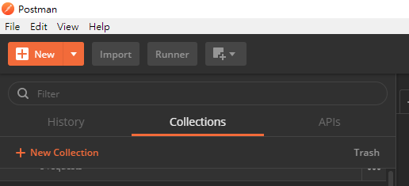

> 同步發表在 [HackMD](https://hackmd.io/@dh-46/swagger-to-postman) & [Medium](https://medium.com/@dh46-tw/swagger-匯入-postman-筆記-af206199b483)

## 方法一

### 1. 取得Swagger的 json link

### 2. 打開Postman 點選 import

### 3. 選擇 Import From Link 頁籤並填入 Json Link

### 4. 勾選 Generate a Postman Collection 後下一步

### 5. 完成!

---

## 方法二

有別於方法一是使用Link的方式Import，另一個方法則是直接將該JSON貼到Paste Raw Text的欄位，其餘步驟皆與方法一相同。

## 補充_單一API匯入 

### 1. 在Swagger上選擇要測試的API並執行

### 2. 複製 curl 區塊的內容

### 3. 打開 Postman 選擇 Import/Paste Raw Text 貼上

### 4. 點選下一步即完成API匯入

## 參考來源

- [How to import Swagger APIs into Postman?](https://stackoverflow.com/q/39072216/9982091)
- [API連線測試_使用Swagger+Postman+Newman進行API測試](https://dotblogs.com.tw/tingi/2018/10/14/001620)
