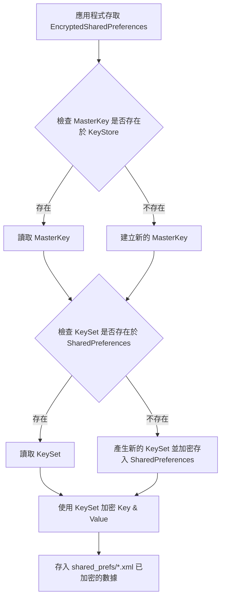

## 介紹

根據[官方文件](https://developer.android.com/topic/security/data.md#key-management)， `EncryptedSharedPreferences` 使用 2-part system 來管理金鑰，並用金鑰加解密儲存的資料。

1. 一組 Keyset（密鑰集合）包含一個或多個 Key（密鑰），用來加密解密資料。這組 Keyset 會儲存在 `SharedPreferences` 裡。
2. 一把 Primary Key (主鑰) 負責加密所有的 Keysets，這把是存在 Android 的 KeyStore 裡面。

### 運作流程



## 資源引用

```groovy
// Encrypted SharedPreference
implementation "androidx.security:security-crypto:1.0.0"

// For Identity Credential APIs
implementation "androidx.security:security-identity-credential:1.0.0-alpha03"

// For App Authentication APIs
implementation "androidx.security:security-app-authenticator:1.0.0-alpha02"

// For App Authentication API testing
androidTestImplementation "androidx.security:security-app-authenticator:1.0.0-alpha02"
```

這個套件基本上也可以對檔案加密，但本篇以實作 `SharedPerefrences` 為主，詳情可以參考 [Work with data more securely](https://developer.android.com/topic/security/data#kotlin)。

## 基本實作

因為 `EncryptedSharedPreferences` 是實作 `SharedPreferences` 介面，所以除了實例化的方式不太一樣外，其他的行為都是跟操作未加密的 `SharedPreferences` 一樣的。

```kotlin
val masterKeys = MasterKeys.getOrCreate(MasterKeys.AES256_GCM_SPEC)
val prefName = "MY_PREFERENCE_NAME"

val preference = EncryptedSharedPreferences.create(
    prefName,
    masterKeys,
    context,
    EncryptedSharedPreferences.PrefKeyEncryptionScheme.AES256_SIV,
    EncryptedSharedPreferences.PrefValueEncryptionScheme.AES256_GCM
)
```

如果是使用 [1.1.0-alpha06](https://developer.android.com/jetpack/androidx/releases/security#1.1.0-alpha06) 後的版本，會發現上面 `MasterKeys` 的寫法被 IDE 提示棄用。
要改用文件新建議的：

```kotlin
val masterKey = new MasterKey.Builder(context)
     .setKeyScheme(MasterKey.KeyScheme.AES256_GCM)
     .build();
```

### 2024 更新：建立的 `SharedPreferences` 必須排除在 Auto-Backup 外

之前沒有注意到自動備份的問題，導致 `SharedPreferences` 建立的 `XXXX.xml` 被自動還原後，可能會因為 Key 遺失，導致 XML 內的資料無法解密。想看除錯紀錄，可以看這篇文章： [Android EncryptedSharedPreference 系統升級後無法解密的錯誤與解決方案](/../posts/2025/android-encryptedsharedpreference-error/)。

> **WARNING**: The preference file should not be backed up with Auto Backup. When restoring the file it is likely the key used to encrypt it will no longer be present. You should exclude all `EncryptedSharedPreference`s from backup using [backup rules](https://developer.android.com/guide/topics/data/autobackup#IncludingFiles).
> 
>  [Doc: EncryptedSharedPreference](https://developer.android.com/reference/androidx/security/crypto/EncryptedSharedPreferences)

- 設定 `android:allowBackup="false"` 避免自動備份。 
- 或在 `backup_rules.xml` 排除 EncryptedSharedPreferences 所建立的檔案。

## 整合成 `PreferenceManager`

為了方便在專案內使用，建立一個 `PreferenceManager` 類別，將 `EncryptedSharedPreferences` 的實例封裝起來。

```kotlin
import android.content.Context  
import android.content.SharedPreferences  
import androidx.security.crypto.EncryptedSharedPreferences  
import androidx.security.crypto.MasterKeys


/**
 *  Created by DanielHuang
 */
open class PreferenceManager(context: Context,  
                             prefName: String,  
                             isEncrypted: Boolean) {  
  
    private val pref: SharedPreferences by lazy {  
        if (isEncrypted) {  
            val masterKeys = MasterKeys.getOrCreate(MasterKeys.AES256_GCM_SPEC)  
            EncryptedSharedPreferences.create(  
                prefName,  
                masterKeys,  
                context,  
                EncryptedSharedPreferences.PrefKeyEncryptionScheme.AES256_SIV,  
                EncryptedSharedPreferences.PrefValueEncryptionScheme.AES256_GCM  
            )  
        } else {  
            context.getSharedPreferences(prefName, Context.MODE_PRIVATE)  
        }  
    }  
  
    open fun setStringValue(key: String, value: String?) {  
        pref.edit().putString(key, value).apply()  
    }  
  
    open fun getStringValue(key: String): String? {  
        return pref.getString(key, "")  
    }  
  
    open fun getBooleanDefFalse(key: String): Boolean {  
        return pref.getBoolean(key, false)  
    }  
  
    open fun getBooleanDefTrue(key: String): Boolean {  
        return pref.getBoolean(key, true)  
    }  
    open fun setBooleanValue(key: String, value: Boolean) {  
        pref.edit().putBoolean(key, value).apply()  
    }  
  
    open fun setLongValue(key: String, value: Long) {  
        pref.edit().putLong(key, value).apply()  
    }  
  
    open fun getLongValue(key: String): Long {  
        return pref.getLong(key, -1)  
    }  
  
    open fun setIntValue(key: String, value: Int) {  
        pref.edit().putInt(key, value).apply()  
    }  
  
    open fun getIntValue(key: String, default: Int = -1): Int {  
        return pref.getInt(key, default)  
    }  
  
    /**  
     * 刪除資料  
     */  
    fun remove(key: String) {  
        pref.edit().remove(key).apply()  
    }  
  
    /**  
     * 清除所有資料  
     */  
    fun clearAll() {  
        pref.edit().clear().apply()  
    }  
  
    /**  
     * check sp is empty or not     * @return  
     */  
    val isEmpty: Boolean  
        get() = pref.all.isEmpty()  
}
```

## 參考資料

- [基礎密碼學(對稱式與非對稱式加密技術)](https://medium.com/@RiverChan/%E5%9F%BA%E7%A4%8E%E5%AF%86%E7%A2%BC%E5%AD%B8-%E5%B0%8D%E7%A8%B1%E5%BC%8F%E8%88%87%E9%9D%9E%E5%B0%8D%E7%A8%B1%E5%BC%8F%E5%8A%A0%E5%AF%86%E6%8A%80%E8%A1%93-de25fd5fa537)
- [Hash是甚麼](https://blockbar.io/blockchain/hash%E6%98%AF%E4%BB%80%E9%BA%BC-what-is-hash/)
- [使用Android KeyStore 儲存敏感性資料](https://medium.com/joe-tsai/%E4%BD%BF%E7%94%A8keystore-%E5%84%B2%E5%AD%98%E6%95%8F%E6%84%9F%E6%80%A7%E8%B3%87%E6%96%99-92ad9b236e58)
- [Android Developers_EncryptedSharedPreferences](https://developer.android.com/topic/security/data#edit-shared-preferences)
- [How to Secure Android Shared Preferences?](https://stackoverflow.com/questions/30148729/how-to-secure-android-shared-preferences)
- [Android KeyStore System](https://developer.android.com/training/articles/keystore)
- [Android Doc_EncryptedSharedPreferences](https://developer.android.com/reference/androidx/security/crypto/EncryptedSharedPreferences)
- [Medium: AndroidX — EncryptedSharedPreferences 中MasterKeys與MasterKeys.AES256_GCM_SPEC deprecated的處理方法](https://jefflin1982.medium.com/androidx-encryptedsharedpreferences-%E4%B8%ADmasterkeys%E8%88%87masterkeys-aes256-gcm-spec-deprecated%E7%9A%84%E8%99%95%E7%90%86%E6%96%B9%E6%B3%95-29b1465fcc3e)
- [Medium: Scott Alexander-Bown - AndroidX: Security library](https://medium.com/@scottyab/androidx-security-d43b6f1e083e)
