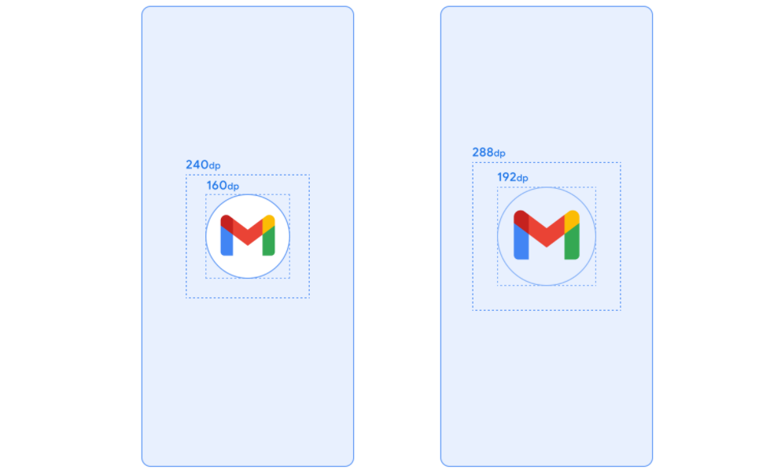
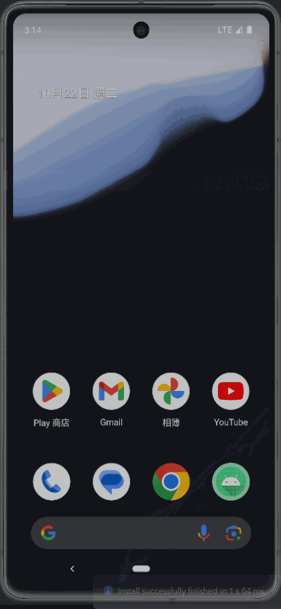

## 一、前言

歡迎畫面會是使用者打開 App 時，第一個看到的畫面，畫面顯示的時間長度，會根據 App 啟動的速度而有所不同。
在 Android 11 以前，歡迎畫面通常都是白色，但在 Android 12 以後，系統會使用 App Icon 與 App theme 中設定的 `windowBackground` 製作 App 的歡迎畫面。

如果我們要客製化 App 的歡迎畫面，該怎麼做呢?

## 二、常見的幾個老方法

在看官方推薦的做法前，先來看一下幾個常見的老方法。

以下討論，讓我們先假設 App 的進入點為專案預設的 `MainActivity`。

### 2-1 在 `MainActivity` 前新增一個 `SplashScreenActivity`

1. 新增一個 `SplashScreenActivity`。
2. 在 `SplashScreenActivity` 的 UI 中繪製歡迎畫面。
3. 使用 `Thread.sleep()` 設定等待秒數。
4. 執行完後跳轉到 `MainActivity`。

簡單、直覺的一個方法。
設計師要一個歡迎畫面，我就刻一個出來。
搭配 `Thread.sleep()`，要顯示幾秒就顯示幾秒。

不過，在 `SplashScreenActivity` 顯示前，使用者還是會看到系統預設的歡迎畫面。
實際進入 App 的使用體驗可能會跟設計師預期的不同，而且有可能等待時間比預期的還要久。

### 2-2 `SplashScreenActivity` 搭配 `windowBackground`

1. 新增一個 `SplashScreenActivity`。
2. 在 `/drawable` 中新增一個 layer-list 的 splash_backgroun.xml

```xml
<?xml version="1.0" encoding="utf-8"?>
<layer-list xmlns:android="http://schemas.android.com/apk/res/android">
    <item android:drawable="@color/white" />

    <item android:drawable="@drawable/ic_icon_vector"
        android:gravity="center"/>
</layer-list>
```

3. 在 `themes.xml` 中新增 `SplashScreenTheme`。

```xml
<!-- Splash Screen theme. -->
<style name="SplashScreenTheme" parent="Theme.AppCompat.NoActionBar">
    <item name="android:windowBackground">@drawable/splash_background</item>
</style>
```

4. 設定 `SplashScreenActivity` 的 Theme。

```xml
<?xml version="1.0" encoding="utf-8"?>
<manifest xmlns:android="http://schemas.android.com/apk/res/android" package="yourpackage">
    <application android:allowBackup="true" 
                 android:icon="@mipmap/ic_launcher" 
                 android:label="@string/app_name" 
                 android:supportsRtl="true" 
                 android:theme="@style/AppTheme">
        
        <activity android:name=".SplashScreenActivity" 
                  android:theme="@style/SplashScreenTheme">
            <intent-filter>
                <action android:name="android.intent.action.MAIN" />
                <category android:name="android.intent.category.LAUNCHER" />
            </intent-filter>
        </activity>

        <activity android:name=".MainActivity" />
    </application>
</manifest>
```

5. `SplashScreenActivity` 執行完後跳轉到 `MainActivity`。

```java
public class SplashScreenActivity extends AppCompatActivity {
    @Override
    protected void onCreate(Bundle savedInstanceState) {
        super.onCreate(savedInstanceState);

        startActivity(new Intent(SplashScreenActivity.this, MainActivity.class));
        finish();
    }
```

跟前一個方法很類似，不過因為是使用 `windowBackground` 的設定，使用者不會看到系統的歡迎畫面。

> [!Note] 參考資料
> - [Best Practice to Implement Splash Screen in Android.](https://medium.com/@pranjalg2308/best-practice-to-implement-splash-screen-in-android-f8b662d558e7)
> - [Implementing the Perfect Splash Screen in Android](https://medium.com/geekculture/implementing-the-perfect-splash-screen-in-android-295de045a8dc)


## 三、最佳實踐

### 3-1 套件設定

#### `libs.versions.toml`

```toml
[versions]
splashScreen = "1.0.0"

# 略...

[libraries]
# Splash Screen
splashscreen = { group = "androidx.core", name = "core-splashscreen", version.ref = "splashScreen"}
```

#### `build.gradle.kts` (app)

```kotlin
dependencies {
    // Splash Screen
    implementation(libs.splashscreen)
}
```

### 3-2 無動畫版本

#### 給 Android 11 以前

1. 建立歡迎畫面的 drawable: `splash_background.xml`

```xml
<?xml version="1.0" encoding="utf-8"?>
<layer-list xmlns:android="http://schemas.android.com/apk/res/android">
    <!--  底色  -->
    <item>
        <color android:color="@color/yellow_ffc700"/>
    </item>
    <!--  畫面中央的圖  -->
    <item
        android:drawable="@drawable/app_logo"
        android:gravity="center"
        android:width="@dimen/dp_200"
        android:height="@dimen/dp_200">
    </item>
</layer-list>
```

如果要調整歡迎畫面中的圖片位置，可以修改 `android:gravity` 的參數。

2. 在 `theme.xml` 中建立 `SplashTheme`

```xml
 <style name="SplashTheme" parent="Theme.SplashScreen.IconBackground">
     <!--  API 30 以前使用 -->
     <item name="android:windowBackground">@drawable/splash_background</item>
     <!--  歡迎畫面呈現後載入預設的 App 主題  -->
     <item name="postSplashScreenTheme">@style/Theme.AppTheme</item>
 </style>
```

3. 設定 `activity` 的 `android:theme`。

```xml
<activity
    android:name=".MainActivity"
    android:exported="true"
    android:theme="@style/SplashTheme">
    <intent-filter>
        <action android:name="android.intent.action.MAIN" />

        <category android:name="android.intent.category.LAUNCHER" />
    </intent-filter>
</activity>
```

#### 給 Android 12 (v31) 以後

Android 12 以後，即便有設定 `windowBackground`，也會被系統的預設歡迎畫面取代，需要另外設定。

1. 建立 v31 版本的 `theme.xml` 並設定 `SplashTheme`

```xml
<?xml version="1.0" encoding="utf-8"?>
<resources>

    <style name="SplashTheme" parent="Theme.SplashScreen.IconBackground">
        <!-- For API 31 and above. -->
        <item name="android:windowSplashScreenBackground">@color/yellow_ffc700</item>
        <item name="android:windowSplashScreenAnimatedIcon">@drawable/img_app_logo</item>
        <!--  load theme for other pages  -->
        <item name="postSplashScreenTheme">@style/Theme.Hensreport</item>
    </style>
</resources>
```

2. `MainActivity.onCreate()` 中呼叫 `installSplashScreen()`

呼叫的時機點要在 `super.onCreate()` 與 `setContentView()` 前。

```kotlin
import androidx.core.splashscreen.SplashScreen.Companion.installSplashScreen

class MainActivity : AppCompatActivity() {

    private val binding: ActivityMainBinding by lazy {
        ActivityMainBinding.inflate(layoutInflater)
    }

    private var navController: NavController? = null

    private val viewModel: MainViewModel by viewModels()

    override fun onCreate(savedInstanceState: Bundle?) {
        // Handle the splash screen transition.
        installSplashScreen()

        super.onCreate(savedInstanceState)
        setContentView(binding.root)
    }
}
```

### 3-3 Icon 裁切問題

歡迎畫面 API 要求的 Icon 規格如下，更多細節可以參考 [Doc: Splash screen dimensions](https://developer.android.com/develop/ui/views/launch/splash-screen#dimensions)。

- 帶有背景的 Icon: 大小 240x240dp，圖示必須在直徑 160dp 的範圍內。
- 不帶有背景的 Icon: 大小 288x288dp，圖示必須在直徑 192dp 的範圍內。



如果沒有特別調整 Icon，放入之後會被系統的圓形遮罩裁切。
而在不調整圖片大小的情況下，可以用以下的方式解決。
以下方式參考自 [StackOverflow: New Splash screen is shown cut in a circle shape](https://stackoverflow.com/a/69895108)。

#### 使用 `inset` tag 建立 inset_logo.xml

```xml
<?xml version="1.0" encoding="utf-8"?>
<inset xmlns:android="http://schemas.android.com/apk/res/android"
    android:drawable="@drawable/ic_npm_logo_white"
    android:inset="@dimen/dp_30">
</inset>
```

#### 將 `SplashTheme` 裡的 `windowSplashScreenAnimatedIcon` 替換成 `inset_logo`

```xml
<style name="SplashTheme" parent="Theme.SplashScreen">

    <item name="android:windowSplashScreenBackground">@color/black_121212</item>
    <item name="android:windowSplashScreenAnimatedIcon">@drawable/inset_splash_icon</item>

    <item name="postSplashScreenTheme">@style/Theme.Npmguide</item>
</style>
```

### 3-4 動畫版

跟無動畫版的主要差別在於 `windowSplashScreenAnimatedIcon`給的圖檔要是`animated-vector`。其他動畫的細部設定，就看 UI/UX 給的設計稿有沒有特別要求。

```xml
<?xml version="1.0" encoding="utf-8"?>
<resources>

    <style name="SplashScreen" parent="Theme.SplashScreen.IconBackground">
        <!-- 歡迎畫面底色 -->
        <item name="android:windowSplashScreenBackground">@color/yellow_ffc700</item>
        <!-- 動畫 Icon -->
        <item name="android:windowSplashScreenAnimatedIcon">@drawable/avd_play_to_pause</item>
        <!-- 動畫 Icon 背景色 -->
        <item name="android:windowSplashScreenIconBackgroundColor">@color/blue_007AFF</item>
        <!-- 動畫時間 (設定這個值對於實際的動畫時間不會有影響) 但可用於自訂結束動畫的行為 -->
        <item name="android:windowSplashScreenAnimationDuration">1000</item>
        <!-- 畫面底部商標圖片 -->
        <item name="android:windowSplashScreenBrandingImage">@drawable/img_branding</item>

        <!-- 歡迎畫面後的 App 主題 -->
        <item name="postSplashScreenTheme">@style/Theme.Androidsplashscreen</item>
    </style>
</resources>
```

以下提供上面範例裡的 `animated-vector`:

```xml
<?xml version="1.0" encoding="utf-8"?>
<animated-vector xmlns:android="http://schemas.android.com/apk/res/android"
    xmlns:aapt="http://schemas.android.com/aapt"
    xmlns:tools="http://schemas.android.com/tools"
    android:drawable="@drawable/ic_pause">
    <target android:name="iconGroup">
        <aapt:attr name="android:animation">
            <set>
                <objectAnimator
                    android:duration="500"
                    android:interpolator="@android:interpolator/fast_out_slow_in"
                    android:propertyName="rotation"
                    android:valueFrom="90"
                    android:valueTo="180" />
            </set>
        </aapt:attr>
    </target>
    <target android:name="iconPath">
        <aapt:attr name="android:animation">
            <objectAnimator
                android:duration="500"
                android:interpolator="@android:interpolator/fast_out_slow_in"
                android:propertyName="pathData"
                android:valueFrom="@string/play_path"
                android:valueTo="@string/pause_path"
                android:valueType="pathType" />
        </aapt:attr>
    </target>
</animated-vector>
```

`ic_pause.xml`

```xml
<?xml version="1.0" encoding="utf-8"?>
<vector xmlns:android="http://schemas.android.com/apk/res/android"
    android:width="120dp"
    android:height="120dp"
    android:viewportWidth="24.0"
    android:viewportHeight="24.0">
    <group
        android:name="iconGroup"
        android:pivotX="12"
        android:pivotY="12"
        >
        <path
            android:name="iconPath"
            android:fillColor="#FF000000"
            android:pathData="@string/pause_path" />
    </group>
</vector>
```

`strings.xml`

```xml
<string name="pause_path">M10,18 H6 L6,6 L10,6 M14,18 H18 L18,6 L14,6</string>
<string name="play_path">M12,16 H5 L8.5,10.5 L12,5 M12,16 H19 L15.5,10.5 L12,5</string>
```




## 參考資料

- 👍[AndroidDeveloper: Splash Screen](https://developer.android.com/guide/topics/ui/splash-screen)
- [Android 12 SplashScreen API快速入门](https://blog.csdn.net/guolin_blog/article/details/120275319)
- [Doc: Migrate your splash screen](https://developer.android.com/develop/ui/views/launch/splash-screen/migrate#migrate)
- [Doc: Splash screen](https://developer.android.com/reference/kotlin/androidx/core/splashscreen/SplashScreen)