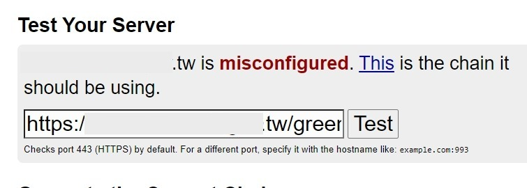
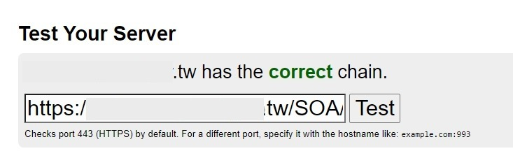
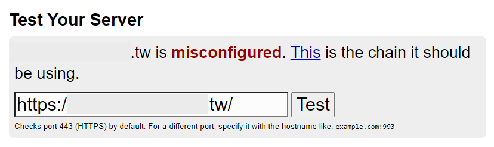
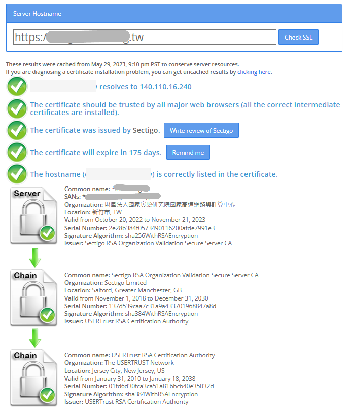

## 問題

網站更換憑證後在電腦瀏覽器上可正常瀏覽，但手機端卻出現憑證無效的錯誤。

```!
javax.net.ssl.SSLHandshakeException: java.security.cert.CertPathValidatorException: Trust anchor for certification path not found.
```

## 原因：缺乏中繼憑證

>  👀 以下截自 [【茶包射手日記】網站憑證無效案例分析](https://blog.darkthread.net/blog/cert-chain-issue/)
>  
>  這篇問題的確單純就是沒裝中繼 CA 憑證，而這問題用PC瀏覽器是測不出來的，因為PC瀏覽器在缺少中繼憑證時，會從憑證的擴充欄位>授權資訊存取>憑證授權單位簽發者中的網址，自動下載中繼憑證，所以不會有問題。但PC瀏覽器以外的client如手機版瀏覽器、curl、寫程式連線等都沒有這個自動下載。
> 
> 另外 SSLLab 其實會指出這個問題，在Additional Certificates (if supplied)區塊就會列出server提供了哪些憑證，如果有缺少中繼憑證問題也會顯示Chain issues: Incomplete

簡單來說就是：

1. 伺服器端沒提供中繼憑證，導致憑證無效。
2. PC 上的瀏覽器因為會自動從憑證授權單位自動下載中繼憑證，所以不會有問題。
3. 其他類型的 Client 沒有這個自動下載的機制，所以會有問題。

### 驗證問題

嘗試手動將中繼憑證加入手機中，確認可以正常瀏覽。

使用 [What's My Chain Cert 憑證設定檢查網站](https://whatsmychaincert.com/)，比對兩個網址的設定，也確實異常的那個網站是有錯誤的。




## 解決方案

很簡單，伺服器端修正憑證設定即可。

## 補充案例

> 2023/05/30
> App 下載離線圖資失敗，經查測後發現一樣是在瀏覽器上可正常連線，但是 App 無法連線。

使用 [What's My Chain Cert 憑證設定檢查網站](https://whatsmychaincert.com/) 檢查，確認是 Misconfigured。



改用 [SSLChecker 憑證設定檢查網站](https://www.sslchecker.com/sslchecker) ，更明確指出斷在哪裡。


伺服器端匯入中繼憑證後，使用 [SSLShopper SSL Checker](https://www.sslshopper.com/ssl-checker.html) 檢查通過。



## 參考資料

- [StackOverflow: Trust Anchor not found for Android SSL Connection](https://stackoverflow.com/a/16302527/9982091)
- [【茶包射手日記】網站憑證無效案例分析](https://blog.darkthread.net/blog/cert-chain-issue/)
- [中繼憑證設定遺失問題](https://blog.cptsai.com/2021/05/04/cert-chain-missing/)
- [【第2代通用憑證管理中心新舊中繼CA憑證差異說明】](https://publicca.hinet.net/SSL_cd2.htm)
- [什麼是中繼憑證](https://tw.godaddy.com/help/what-is-an-intermediate-certificate-868)

### 憑證檢查網站

- [What'sMyChainCert 憑證設定檢查網站](https://whatsmychaincert.com/)
- [SSLChecker 憑證設定檢查網站](https://www.sslchecker.com/sslchecker)
- [SSLShopper SSL Checker](https://www.sslshopper.com/ssl-checker.html)
