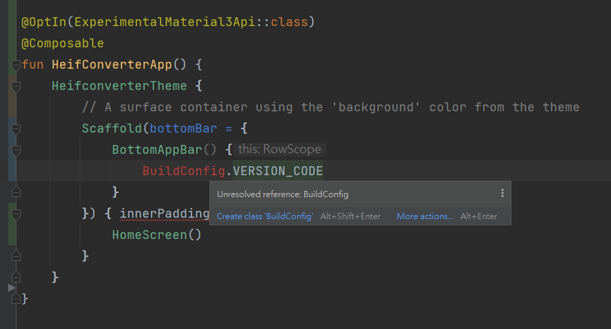

## 問題



最近開新專案的時候，發現寫 BuildConfig 都沒有出現 prompt，後來才發現是新的專案要另外開設定。

## 什麼是 `BuildConfig`

`BuildConfig` 是 Gradle 在編譯時期自動建立的類別，裡面包含目前建製版本的相關資訊，開發者也可以[自行加入客製化的欄位資料](https://developer.android.com/build/gradle-tips#share-custom-fields-and-resource-values-with-your-app-code)。

## 為什麼會有這個問題?

根據 [解決 Android Studio 中的 BuildConfig 找不到問題](https://limouth.com/programming/android-buildconfig-notfound/) 與 [Fixing the "Build Type contains custom BuildConfig fields, but the feature is disabled" error w/ buildConfigField](https://stackoverflow.com/a/74634322/9982091)的資訊，可以知道 Gradle 8.0.0 後的版本，預設 `BuildConfig` 是關閉的。

## 解法

在 module 的 `build.gradle` 中新增以下程式碼，在重新 build project 即可。

```groovy
// (app) build.gradle
android {
    
    // 略...
    
    buildFeatures {
        // 開啟
        buildConfig true
    }
}
```
