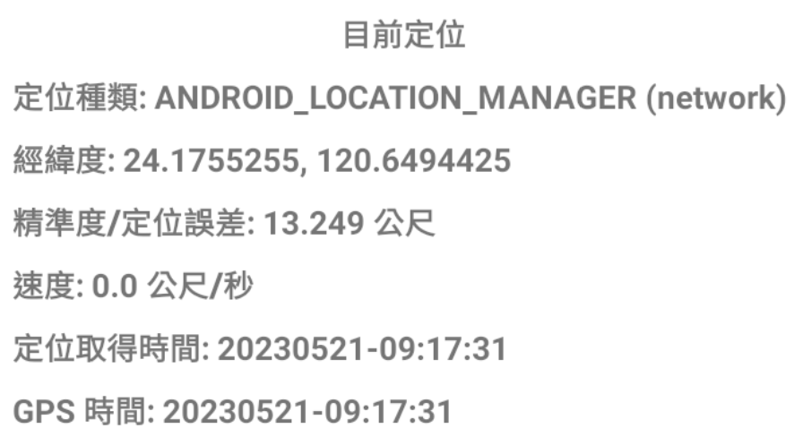
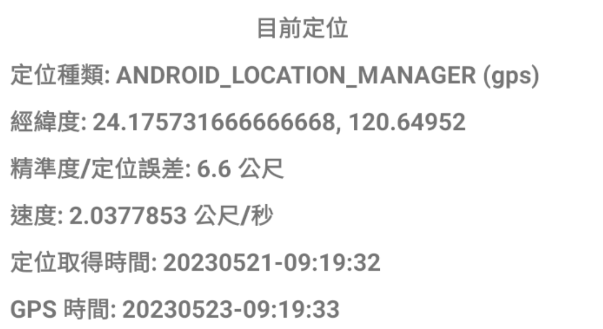
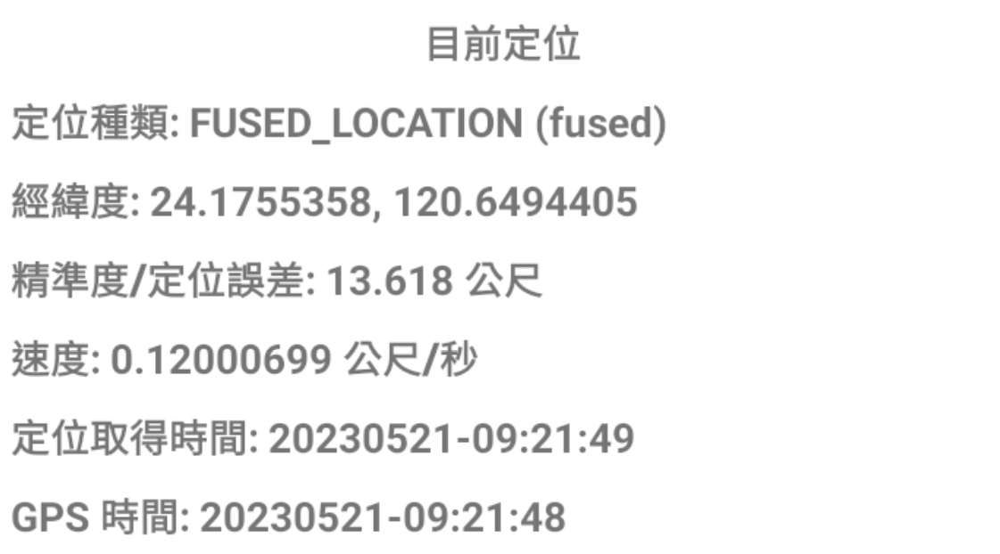

> Photo by <a href="https://unsplash.com/@spacex?utm_source=unsplash&utm_medium=referral&utm_content=creditCopyText">SpaceX</a> on <a href="https://unsplash.com/images/nature/satellite?utm_source=unsplash&utm_medium=referral&utm_content=creditCopyText">Unsplash</a>

## 前言

最近的專案需要取定位的時間，並用該時間判斷使用者是否有在指定時間完成任務，而業主就提出希望以定位所取得的時間做為判斷依據。

然後，就發現事情沒有想像中的那麼單純。

原來目前在 Android 的定位結果中所取得的時間，只有在定位來源為純 GPS 的情況下才會是衛星所回傳的時間。

來看看究竟是怎麼一回事吧...

## 先認識 Location 型別

不論是使用 Android 官方推薦的 [Fused Location Provider](https://developers.google.com/location-context/fused-location-provider) 或是 [LocationManager](https://developer.android.com/reference/android/location/LocationManager) ，定位結果所回傳的型別都是 [`Location`](https://developer.android.com/reference/android/location/Location)。這個型別除了基本的經緯度與海拔等資訊，其中也包含定位的時間。

通常開發上指的定位時間，我們會使用 `Location.getTime()` 取得 Unix epoch time，再將這串數字轉成人類可閱讀的時間格式。

> Unix epoch time：_從 UTC 1970 年 1 月 1 日 0 時 0 分 0 秒起至現在的總秒數，不考慮閏秒。_  
> -- [Wikipedia](https://zh.wikipedia.org/zh-tw/UNIX%E6%97%B6%E9%97%B4)

## `Location.getTime()` 會跟定位來源有關

從 [Android Doc: Location.getTime()](https://developer.android.com/reference/android/location/Location#getTime()) 的說明會發現，不同的定位結果所取得的時間來源不見得相同。

當定位結果是由 `LocationManager.GPS_PROVIDER` 提供的時候，時間會是由衛星所提供。如果是其他的 Provider，時間來源則不一定，不過通常會是使用裝置系統的 Unix epoch time。

> _There is no guarantee that different locations have times set from the same clock. Locations derived from the LocationManager#GPS_PROVIDER are guaranteed to have their time originate from the clock in use by the satellite constellation that provided the fix. Locations derived from other providers may use any clock to set their time, though it is most common to use the device’s Unix epoch time system clock (which may be incorrect)._
> 
> [Android Doc: Location.getTime()](https://developer.android.com/reference/android/location/Location#getTime()) 

除了以上，文件上也提醒了

1. 裝置所回傳的時間 (Unix epoch time) 有可能會不準確，且使用者也可能自行更改系統時間。  
2. 如果需要透過時間來比較兩個時間，官方建議使用 [Location.getElapsedRealtimeNanos()](https://developer.android.com/reference/kotlin/android/location/Location#getElapsedRealtimeNanos()) 來進行定位時間比較，不過這個 elapsed realtime 是參考自系統啟動，所以如果比較的兩個時間有橫跨裝置重啟，則不建議使用。
3. 因為定位結果是產生出來的，系統時間在這過程中有可能有變動。

## 歸納目前幾種定位方式與其回傳值

看完文件的説明，再加上 [StackOverflow: GPS-time in Android](https://stackoverflow.com/a/36470075/9982091) 的回答，目前已知訊息可以歸納如下。

- ✔ 使用 [Google Fused Location API](https://developers.google.com/location-context/fused-location-provider) 時
    - 使用混和式定位 GPS & Wi-Fi/Network
    - `getProvider()` 會回傳 `fused`
    - `getTime()` 回傳的會是裝置系統時間。
- ✔ 使用 [Android Location Manager](https://developer.android.com/reference/android/location/LocationManager) 時，
    - 設定 Provider 為 `LocationManager.NETWORK_PROVIDER`:
        - 使用 Wi-Fi / Network 定位。
        - `getProvider()` 會回傳 `network`
        - `getTime()` 回傳的會是裝置系統時間。
    - 設定 Provider 為 `LocationManager.GPS_PROVIDER`:
        - 使用 GPS 定位。
        - `getProvider()` 會回傳 `gps`
        - `getTime()` 回傳的會是 GPS (Satellite) 時間。

### 實測驗證 ⚗

將裝置時間設為 2023/05/21，實際時間是 2023/05/23。實測後會發現只有 GPS Provider 下的 GPS 時間會顯示現實世界的時間，其他的都會是顯示裝置設定的時間。

| 定位類型                                 | 實測結果                                                  |
| ------------------------------------ | ----------------------------------------------------- |
| LocationManager Network Provider |  |
| LocationManager GPS Provider     |      |
| Fused Location                       |   |

## 結論

在 Android 裝置上，如果要取得不受裝置時間設定影響的衛星時間，要使用 `LocationManager` 並將請求的定位來源設定為 `LocationManager.GPS_PROVIDER` ，否則拿到的時間都會是裝置時間哦！！

## 2024/08/26 更新: 部分裝置上 GPS_PROVIDER 拿到的時間可能不準確

經過實測發現，有些裝置的 GPS 晶片受到 [GPS Week Number rollover](https://en.wikipedia.org/wiki/GPS_week_number_rollover) 問題的影響，產出的 GPS 時間是錯誤的。在開發上需要手動將相差時間秒數加回原始值，才能取得正確的時間。

有關這個問題，細節可以看 [如何在 Android 上取得準確且不被用戶竄改的時間](/posts/2024/android-true-time/) 這篇文章中的說明。

---

> 本文同步更新在 [Medium](https://medium.com/@dh46tw/android-%E5%AE%9A%E4%BD%8D%E7%B5%90%E6%9E%9C%E7%9A%84-location-gettime-%E4%B8%8D%E4%B8%80%E5%AE%9A%E6%98%AF%E8%A1%9B%E6%98%9F%E6%99%82%E9%96%93-72bbdffdb67c)