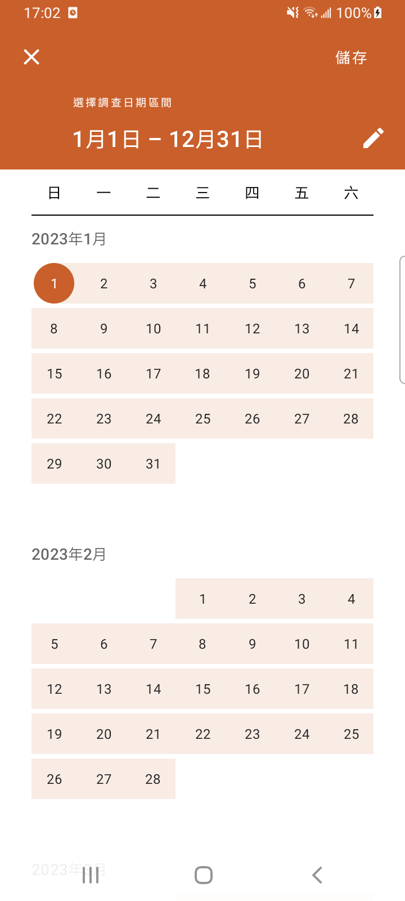
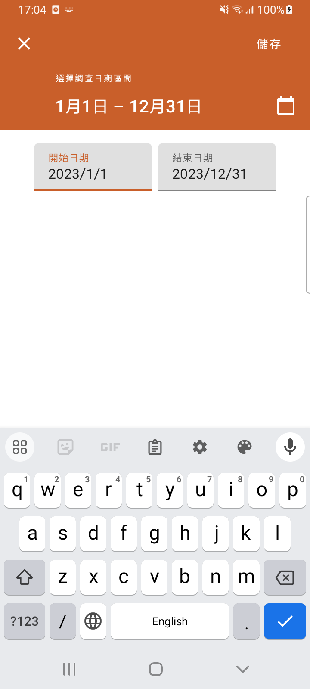
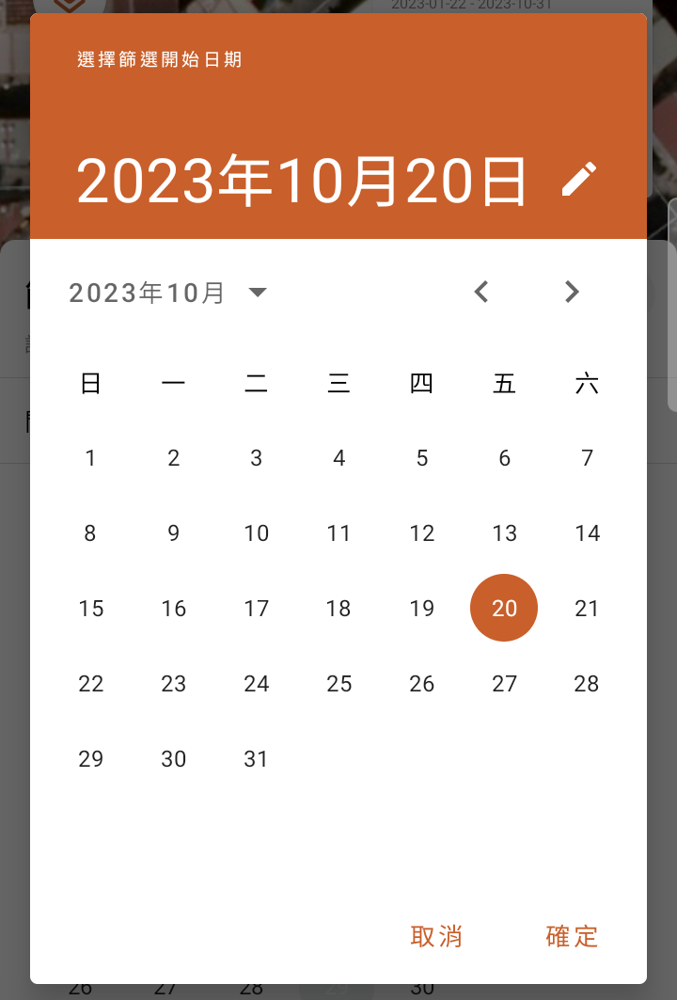
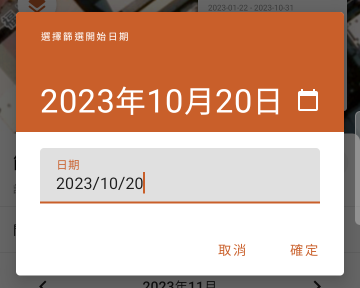
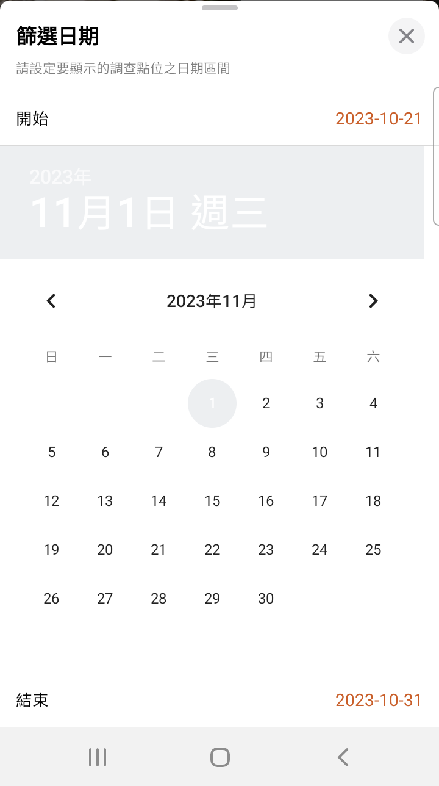
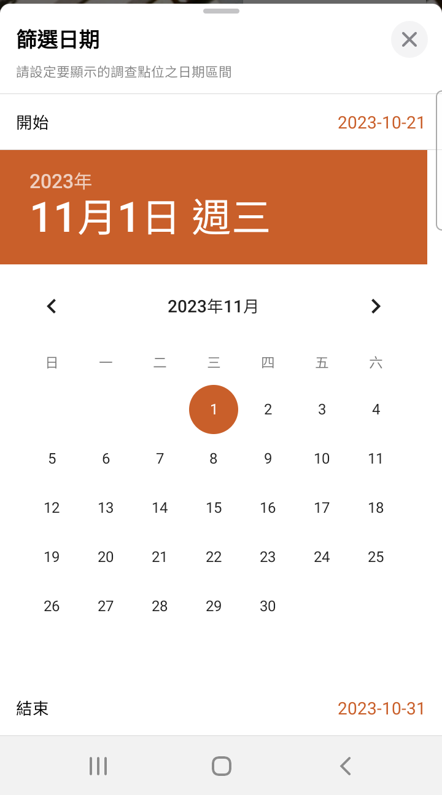
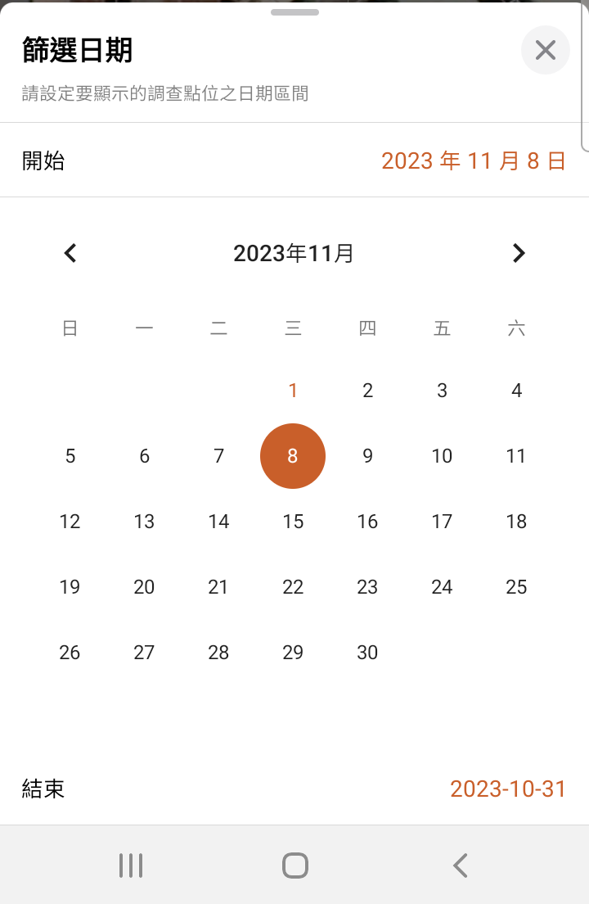

---
tags:
  - Android/UI
title: Android UI 日期時間選擇 DatePicker
date: 2023-10-31
---

## 簡介

Android 原生提供的日期時間選擇 UI。
官方推薦使用 Material Design 的 API

## MaterialDatePicker (Dialog)

### 日期區間選擇 DateRangePicker

|  |     |
| ------------------------------------------- | ------------------------------------------- |

#### Kotlin

```kotlin
import com.google.android.material.datepicker.MaterialDatePicker

val datePicker = MaterialDatePicker.Builder.dateRangePicker()  
    .setTitleText("選擇調查日期區間")  
    .setSelection(Pair(startPeriod, endPeriod))  
    .build()
    
datePicker.show(childFragmentManager, TAG_DATE_RANGE_PICKER)

datePicker.addOnPositiveButtonClickListener {  
    startPeriod = it.first  
    endPeriod = it.second  
    setTvStartAndEnd()  
}
```

#### Java

```java
import androidx.core.util.Pair;
import com.google.android.material.datepicker.MaterialDatePicker;

MaterialDatePicker<Pair<Long, Long>> dateRangePicker =  
        MaterialDatePicker.Builder.dateRangePicker()  
                .setTitleText(R.string.date_filter)  
                .setSelection(Pair.create(startTime, endTime))  
                .build();  
  
dateRangePicker.addOnPositiveButtonClickListener(selection -> mMainViewModel.setFilterPeriod(selection));  
  
dateRangePicker.show(getChildFragmentManager(), TAG_DATE_PICKER);
```

使用 `MaterialDatePicker.Builder.dateRangePicker` 建立，可設定 UI 上的標題 (`setTitleText()`) 與預選的日期區間 (`setSelection`)。
`dateRangePicker` 是泛型 `Pair<Long, Long>`，`Pair`  中儲存的是開始日期與結束日期的 UNIX時間(`milliseconds`)。

`addOnPositiveButtonClickListener` 在 Callback 中可取得使用者選取的起始日期結果，型別一樣是 `Pair<Long, Long>`。

> 📢 使用回饋
> 
> 使用上會有卡頓的情況發生，StackOverflow 跟 GitHub Issues 的討論都沒有找到解決方式。
> 比較主流的建議是改用 DatePicker 就沒這個問題了。

### 單一日期選擇 DatePicker

|     |     |
| --- | --- |

```kotlin
import com.google.android.material.datepicker.MaterialDatePicker

val datePicker = MaterialDatePicker.Builder.datePicker()  
    .setTitleText("選擇篩選結束日期")  
    .setSelection(DateUtils.toMilliseconds(DateUtils.DATE_yyyy_MM_dd, endDate))
    .setCalendarConstraints(CalendarConstraints.Builder().setEnd(endMillis).build())
    .build()
datePicker.addOnPositiveButtonClickListener {  
    binding.includeEndDate.tvDate.text =  
        DateUtils.millisTimeConvertDateStr(it, DateUtils.DATE_yyyy_MM_dd)  
}  
datePicker.show(childFragmentManager, TAG_DATE_PICKER_END)
```

- `setCalendarConstraints()` 限制日曆可選擇的範圍。
	- 使用 `CalendarConstraints.Builder()` 建立輸入 `CalendarConstraints` 參數。
		- `setEnd()` 設定結束日期
		- `setStart()` 設定開始日期

### 開發上遇到的問題紀錄

#### 2024/11/12 materialCalendarFullscreenTheme attribute

```
java.lang.IllegalArgumentException: com.google.android.material.datepicker.MaterialDatePicker requires a value for the com.emct.ppssurvey.dev:attr/materialCalendarFullscreenTheme attribute to be set in your app theme. You can either set the attribute in your theme or update your theme to inherit from Theme.MaterialComponents (or a descendant).
```

專案中使用 MaterialDatePicker  卻出現上述錯誤資訊造成閃退。
專案的 Theme 是繼承 `Theme.MaterialComponents.Light.DarkActionBar.Bridge`，誠如錯誤訊息中所寫的，專案已有繼承 `Theme.MaterialComponents`，但不知道為什麼仍報這個錯誤。

以下是解決方案:

1. 按照錯誤訊息，在目前 App 的 Theme 中，加入 `materialCalendarFullscreenTheme` 屬性，就可以正常開啟了。 (在不改動其他前人設定的主題下，我在這次的情況中，選擇這個方法。)

```xml
<style>
	<item name="materialCalendarFullscreenTheme">@style/ThemeOverlay.MaterialComponents.MaterialCalendar.Fullscreen</item>
</style>
```

2. 檢查原本 App Theme 繼承的 `Theme.MaterialComponents` ，如果是 `xxx.Bridge`，改繼承沒有 `Bridge` 的版本。
3. 如果都還是不行，可以嘗試在 App Theme 中加入下列這三個屬性。

```xml
<item name="materialCalendarStyle">@style/Widget.MaterialComponents.MaterialCalendar</item>
<item name="materialCalendarFullscreenTheme">@style/ThemeOverlay.MaterialComponents.MaterialCalendar.Fullscreen</item>
<item name="materialCalendarTheme">@style/ThemeOverlay.MaterialComponents.MaterialCalendar</item>
```

以上解法，部分參考自這篇 [StackOverflow](https://stackoverflow.com/a/60870678/9982091) 。

## DatePicker



```xml
<DatePicker  
    android:layout_width="match_parent"  
    android:layout_height="wrap_content" />
```

設定日期選擇的事件回呼，取得使用者選取日期的結果。

```kotlin
// 使用 ViewBinding 取得 View 並設定 Listener
binding.datePicker.setOnDateChangedListener { view, year, monthOfYear, dayOfMonth ->  
	// 這裡使用 Timber 取代原生的 Log 印出選取的結果
    Timber.d("$year / ${monthOfYear+1} / $dayOfMonth")  
}
```

### 問題

使用 `android:headerBackground="@color/orange_C95F2A"` 可以調整上方 Header 的背景顏色，但其他選取顏色的調整目前沒找到對應的參數。

參照 StackOverflow 上的說明，比較多的方式是透過 `theme` 或 `style` 的設定。

1. 先在 `style.xml` 設定主題。

```xml
<style name="DatePickerTheme" parent="Theme.AppCompat.DayNight.Dialog">  
    <item name="colorAccent">@color/orange_C95F2A</item>  
</style>
```

2. 設定 `DatePicker` 使用的 `android:theme`。

```xml
<DatePicker  
    android:layout_width="match_parent"  
    android:layout_height="wrap_content"  
    android:theme="@style/DatePickerTheme"/>
```



但是使用 `DatePicker` 比較大的問題是寬度沒辦法完全的 `match_parent`。

1. 透過 `scaleX`、`scaleY`設定只是將 View 縮放，沒有解決問題。
2. 在上層 ViewParent 用 `layout_gravity="center"` 或是自身設定 `gravity="center"`，也沒用。
3. [建議](https://stackoverflow.com/q/47467550/9982091)使用 `CalendarView`。

## CalendarView



```xml
<CalendarView  
    android:id="@+id/calendar_start"  
    android:layout_width="match_parent"  
    android:layout_height="wrap_content"  
    android:layout_gravity="center"  
    android:theme="@style/DatePickerTheme"/>
```

```xml
<style name="DatePickerTheme" parent="Theme.AppCompat.DayNight.Dialog">  
    <item name="colorAccent">@color/orange_C95F2A</item>  
</style>
```

```kotlin
// 使用 ViewBinding 取得 View 並設定預設日期的 Unix Time (Long)
binding.calendarStart.date = DateUtils.toMilliseconds(DateUtils.DATE_yyyy_MM_dd, startDate)
// 使用 ViewBinding 取得 View 並設定 Listener
binding.calendarStart.setOnDateChangeListener { view, year, month, dayOfMonth ->  
    // 這裡使用 Timber 取代原生的 Log 印出選取的結果
    Timber.d("$year / ${month + 1} / $dayOfMonth")
}
```

跟 `DatePicker` 很類似，樣式的部分使用 `android:theme` 設定。預設日期與日期選擇回呼也很類似。

這個方法的缺點是使用者無法直接切換年份，只能透過月份選擇慢慢換到所需的年份。

## 參考資料

- [Doc: CalendarView](https://developer.android.com/reference/android/widget/CalendarView)
- [Day26 Android - datepicker+timepicker(日期+時間選擇器)](https://ithelp.ithome.com.tw/articles/10262937)
- [Material 2 DatePicker](https://m2.material.io/components/date-pickers/android#date-pickers)
