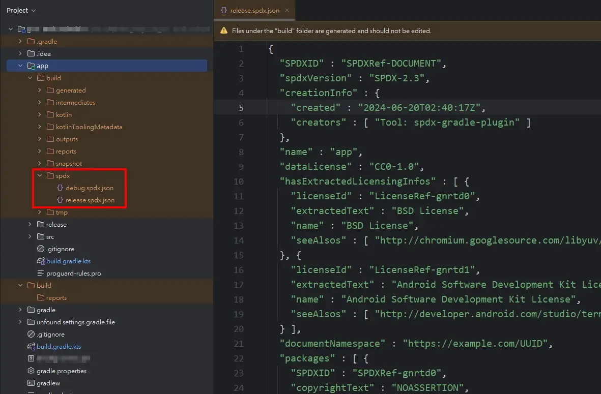
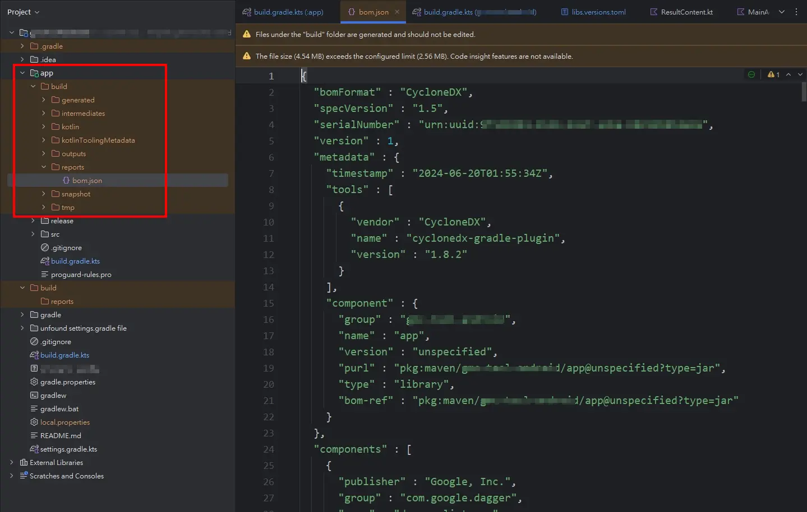

## 前言

公司專案近期收到客戶的要求，疑似因為數發部想推動[公部門的開放原始碼](https://code.gov.tw/)，需要廠商填寫系統相關資訊，其中一項就包含 SBOM 軟體物料清單。

### 什麼是 SBOM 軟體物料清單

SBOM 全稱為 Software Bill of Materials，中文翻譯為**軟體物料清單**。

白話來說，SBOM 就是一份描述軟體專案使用到的套件清單，就像買零食會看到的原料清單一樣。

SBOM 需要包含:

1. 供應商名稱
2. 套件名稱
3. 套件版本
4. 其他可識別套件的 ID
5. 依賴關係
6. SBOM表作者
7. 產表時間

SBOM 的報告格式:

- [Software Package Data Exchange (SPDX)](https://spdx.dev/): Linux 基金會推動。
- [CycloneDX](https://cyclonedx.org/): OWASP 發行。
- [Software Identification (SWID) Tags](https://csrc.nist.gov/projects/Software-Identification-SWID): ISO & IEC 發行。

### 為什麼要做

讓採購方可以清楚知道，該軟體中有使用到哪些套件，進而在採購與使用前發現有疑慮的資安問題。

> [OCF Lab 拒絕受駭！美國推行「軟體物料清單」公開軟體組成，採購更安心](https://lab.ocf.tw/2021/09/02/sbom/)

## 實作

### SPDX Gradle Plugin

[Github: spdx/spdx-gradle-plugin](https://github.com/spdx/spdx-gradle-plugin)

#### libs.versions.toml

```toml=
[versions]
# ...
spdx = "0.8.0"

[plugins]
# ...
spdx = { id = "org.spdx.sbom", version.ref = "spdx"}
```

#### Top-Level build.gradle.kts

```kotlin=
// Top-level build file where you can add configuration options common to all sub-projects/modules.
plugins {
    // 略...
    // 加入
    alias(libs.plugins.spdx) apply false
}
```

#### build.gradle.kts (App Level)

```kotlin=
plugins {
    // 略...
    alias(libs.plugins.spdx)
}

// 加入以下
spdxSbom {
    targets {
        create("release") {
            configurations.set(listOf("releaseRuntimeClasspath"))
        }
    }
}
```

> 📂 參考資料
>  [Issue: Project Configuration Question #49](https://github.com/spdx/spdx-gradle-plugin/issues/49)
#### 使用 Gradle 指令執行

```gradle=
gradle spdxSbom
```

⚡ 執行成功後，會在 `app/build/spdx/` 路徑下找到產出的 JSON 檔。



### CycloneDX Gradle Plugin

[Github: CycloneDX Gradle Plugin](https://github.com/CycloneDX/cyclonedx-gradle-plugin)

#### libs.versions.toml

```toml=
[versions]
# ...
cycloneDx = "1.8.2"

[plugins]
# ...
cyclonedx = {id = "org.cyclonedx.bom", version.ref = "cycloneDx"}
```

#### build.gradle.kts (top level)

```kotlin=
// Top-level build file where you can add configuration options common to all sub-projects/modules.
plugins {
    // ...
    alias(libs.plugins.cyclonedx) apply false
}
```

#### build.gradle.kts (app module)

```kotlin=
plugins {
    // ...
    alias(libs.plugins.cyclonedx)
}

tasks.cyclonedxBom {
    setIncludeLicenseText(true)
    setOutputFormat("json")
    setSkipConfigs(
        listOf(
            "debugCompileClasspath",
            "debugAndroidTestCompileClasspath",
            "debugUnitTestCompileClasspath",
            "debugUnitTestRuntimeClasspath",
            "debugApiElements",
            "debugRuntimeElements",
            "debugImplementationDependenciesMetadata",

            "releaseCompileClasspath",
            "releaseAndroidTestCompileClasspath",
            "releaseUnitTestCompileClasspath",
            "releaseUnitTestRuntimeClasspath",
            "releaseApiElements",
            "releaseRuntimeElements",
        )
    )
}
```

#### 使用 gradle 指令執行

```gradle=
gradle cyclonedxBom
```

⚡ 執行成功後，會在 `app/build/reports/bom.json` 路徑下找到產出的 JSON 檔。



#### 補充：測試過程中遇到的小問題 👀

一開始在 App Level 的 build.gradle 中加入以下參數並執行

```gradle!
tasks.cyclonedxBom {
    setIncludeLicenseText(true)
    setOutputFormat("json")
    setSkipConfigs(
        listOf(
            "debugApiElements","releaseApiElements","releaseRuntimeElements"
        )
    )
}
```

執行後出現以下錯誤:

```!
Execution failed for task ':app:cyclonedxBom'.
> The consumer was configured to find a library for use during compile-time, preferably optimized for Android, as well as attribute 'com.android.build.api.attributes.BuildTypeAttr' with value 'debug', attribute 'com.android.build.api.attributes.AgpVersionAttr' with value '8.4.0', attribute 'org.jetbrains.kotlin.platform.type' with value 'androidJvm'. However we cannot choose between the following variants of project :app:
    - Configuration ':app:debugApiElements' variant android-app-symbol-for-data-binding declares a library for use during compile-time, preferably optimized for Android, as well as attribute 'com.android.build.api.attributes.AgpVersionAttr' with value '8.4.0', attribute 'com.android.build.api.attributes.BuildTypeAttr' with value 'debug', attribute 'org.jetbrains.kotlin.platform.type' with value 'androidJvm':
        - Unmatched attributes:
            - Provides attribute 'artifactType' with value 'android-app-symbol-for-data-binding' but the consumer didn't ask for it
            - Provides attribute 'com.android.build.gradle.internal.attributes.VariantAttr' with value 'debug' but the consumer didn't ask for it
            
// 以下省略...
```

查到[專案 Issue](https://github.com/CycloneDX/cyclonedx-gradle-plugin/issues/256)上的討論串，最後在[最後一則留言](https://github.com/CycloneDX/cyclonedx-gradle-plugin/issues/256#issuecomment-1968821827)提到的[Wikimedia App 的專案](https://github.com/wikimedia/apps-android-wikipedia/commit/e7f27c964a8b8a654d4102e9b3c123fbf3c1845d)裡找到可用的參數。
## 參考資料

- [艾索科技: 什麼是 SBOM ?](https://www.aisol.com.tw/index.php?action=solution&cid=23&id=197)
- [國立台灣大學計資中心: 簡介軟體物料清單](https://www.cc.ntu.edu.tw/chinese/epaper/home/20240320_006805.html)。
- [讓 Hacking for Dummies 一書陪我 30 天系列 第 29 篇 - 軟體物料清單](https://ithelp.ithome.com.tw/articles/10281520)
- [NTIA-SOFTWARE BILL OF MATERIALS](https://www.ntia.gov/page/software-bill-materials)