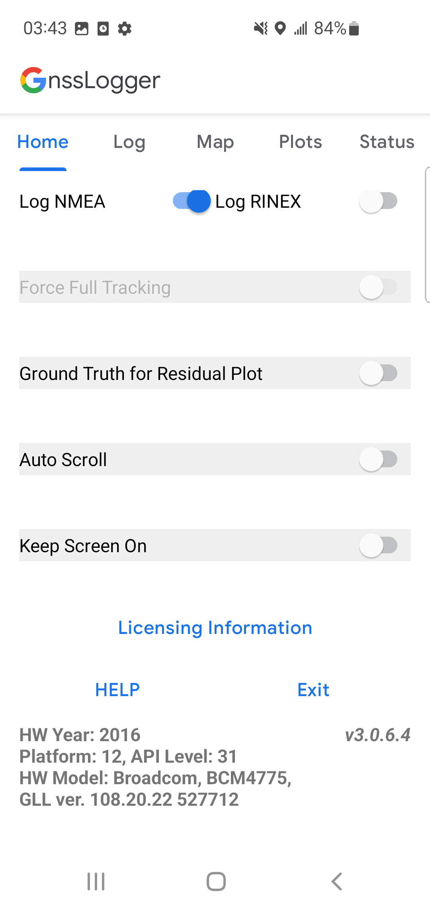

## 一、前言

前陣子專案有一項需求，是希望 App 能夠**取得準確且不會被使用者竄改的時間**。
研究了一下 [StackOverflow: How do I get the most accurate time with Android?](https://stackoverflow.com/a/21760337/9982091) 上面的討論，決定整理成一篇完整的筆記，也許能拯救到未來的自己? XD

<!-- > 以下內容，相關的實作細節可參考 [Sample App: android-real-time](https://github.com/dh46tw/android-real-time)
> [name=Daniel Huang][time=Tue, Jun 6, 2023 5:03 PM][color=#5e7ee0] -->

### 1-1 在 Android 中取得當下時間

大家應該都會直覺地想到以下幾個方式:

1. `System.currentTimeMillis()`。
2. `Calendar.getInstance()`
3. `Instant.now()`

但這幾個方式，拿到的時間都是所謂的系統時間，只要使用者到系統設定中手動調整，就可以輕易地修改這幾個方式回傳的時間。

## 二、Android SDK 的 `SystemClock`

Android 的 [SystemClock](https://developer.android.com/reference/android/os/SystemClock) 類別中，有提供以下兩個方法可以拿到準確的時間。

### 2-1 SystemClock.currentGnssTimeClock()

時間跟稍後會提到的[LocationManager.GPS_PROVIDER](#使用-LocationManager)拿到的時間一樣。

- 官方文件 [`SystemClock.currentGnssTimeClock()`](https://developer.android.com/reference/android/os/SystemClock#currentGnssTimeClock())
- _Returns a Clock that starts at January 1, 1970 00:00:00.0 UTC, synchronized using the device's location provider._
- API 29 以上

```kotlin
import android.os.Build
import android.os.SystemClock

import java.time.ZoneId
import java.time.ZonedDateTime
import java.time.format.DateTimeFormatter


fun getGpsApiDateTime(): String {
    return if (Build.VERSION.SDK_INT >= Build.VERSION_CODES.Q) {
        try {
            val zoneClock =
                SystemClock.currentGnssTimeClock().withZone(ZoneId.of("Asia/Taipei"))
            ZonedDateTime.now(zoneClock).format(dateTimeFormatter)
        } catch (e: Exception) {
            "GNSS NOT AVAILABLE"
        }
    } else {
        "SYSTEM NOT AVAILABLE"
    }
}
```

:::danger
📢 注意! 在部分裝置上，GNSS API 回傳的時間有可能是錯誤的...
細節請看 [問題-GNSS-API-與-Location-Provider-所拿到的時間可能是錯誤的](#問題-GNSS-API-與-Location-Provider-所拿到的時間可能是錯誤的)。
:::

### 2-2 SystemClock.currentNetworkTimeClock()

[`SystemClock.currentNetworkTimeClock()`](https://developer.android.com/reference/android/os/SystemClock#currentNetworkTimeClock())
- _Returns a Clock that starts at January 1, 1970 00:00:00.0 UTC, synchronized using a remote network source outside the device._
- API 33 以上

## 三、NTP

在裝置連網的情況下，一個可靠的方式，是向遠端的 NTP Server 同步時間。
以下提供兩種取得 NTP 時間的方式。

### 3-1 第三方套件: True-Time


[Github: instacart/truetime-android](https://github.com/instacart/truetime-android/)

- 別人包好的套件。 
- 基本的概念也是透過向 NTP Server 更新，來取得真實的時間以校正。並搭配 `SystemClock.elapsedRealtime()` 去計算目前的時間，所以可以不用一直連網，如果裝置有重啟也會自動更新 NTP 時間。
- [消息來源 StackOverflow](https://stackoverflow.com/a/75038584/9982091)

>  👀 甚麼是 [SystemClock.elapsedRealtime](https://developer.android.com/reference/android/os/SystemClock#elapsedRealtime())? 
> 👉 系統從開機到現在的時間，即便休眠中也會記錄。

#### Application 層初始化

```kotlin
class RealTimeApp : Application() {

    override fun onCreate() {
        super.onCreate()

        // ...
        initTrueTime()
    }

    private fun initTrueTime() {
        val trueTime: TrueTimeImpl by inject()
        trueTime.sync()
    }
}
```

#### 取得時間

```kotlin
import com.instacart.truetime.time.TrueTime

import java.time.Instant
import java.time.ZoneId
import java.time.ZonedDateTime
import java.time.format.DateTimeFormatter


fun getNtpDateTime(): String {
    return ZonedDateTime.ofInstant(
        trueTime.now().toInstant(),
        zoneId
    ).format(dateTimeFormatter)
}
```

### 3-2 自己實作 SNTPClient

如果不想引用外部的第三方函式庫，可以考慮自己實作，但以下這個 Github 專案，我還沒有實測過，先放上來給需要的人參考。

[SNTPClient for Android](https://github.com/aslamanver/sntp-client-android)

## 四、GPS 時間

如果裝置是需要在沒有網路下仍要取得準確的時間，這時候就要考慮使用 GPS 時間。

### 4-1 使用 LocationManager 的 GPS_PROVIDER

參考以下兩篇筆記，

1. [Android 定位結果的 `Location.getTime()` 不一定是衛星時間](/posts/2023/android-location-get-time/)
2. [Android 取得即時定位 LocationManager](/posts/2023/android-location-manager/)

可以透過將 `LocationManager.requestLocationUpdates()` 的參數設定為

- provider: 設定為 `LocationManager.GPS_PROVIDER`
- `minTimeMs`: 定位結果更新時間區間最小毫秒設定為 `500L` 毫秒。
- `minDistanceM`: 定位結果更新距離最小公尺設定為 `0f` 公尺。

```kotlin
locationManager.requestLocationUpdates(
    provider,
    minTimeMs = 500L,
    minDistanceM = 0f,
    locationListener,
)
```

此設定將強迫定位結果每秒更新一次，然後就可以在 `LocationListener.onLocationChanged(location)` 中的 `location.time` 取得衛星時間。

> 📢 注意! 在部分裝置上，Location API 回傳的時間有可能是錯誤的...
> 細節請看 [問題-GNSS-API-與-Location-Provider-所拿到的時間可能是錯誤的](#五gnss-api-與-location-provider-所拿到的時間可能是錯誤的)。

### 4-2 NMEA `LocationManager.OnNmeaMessageListener`

NMEA 是從 GPS 衛星所取得的衛星與定位資訊，回傳的資料中也帶有時間資訊。
想要了解更多有關 NMEA 的細節，可以參考以下兩個連結：

- [NMEA標準格式 -- GPS](https://shyuanliang.blogspot.com/2009/08/nmea-gps.html)
- [GPS-NMEA sentence information: RMC](https://aprs.gids.nl/nmea/#rmc)

NMEA 的資訊有很多種類型，這裡我們要接收與解析的是 `GNRMC` 開頭的訊息，其範例與格式如下：

```
$GNRMC,040404.00,A,2410.982071,N,12037.531786,E,0.0,,030824,3.0,W,A,V*6C

$GPRMC,220516,A,5133.82,N,00042.24,W,173.8,231.8,130694,004.2,W*70
        1    2    3    4    5     6    7    8      9     10  11 12


1   220516     Time Stamp (hhmmss.ss)
2   A          validity - A-ok, V-invalid
3   5133.82    current Latitude
4   N          North/South
5   00042.24   current Longitude
6   W          East/West
7   173.8      Speed in knots
8   231.8      True course
9   130694     Date Stamp (ddmmyy)
10  004.2      Variation
11  W          East/West
12  *70        checksum
```

觀察上述的範例，可以知道我們要解析的目標有: 

- `Time Stamp`: 時間戳記，格式是 `hhmmss.ss`。
- `validity`: 資料有效性，A 代表有效、V 代表無效。
- `Date Stamp`: 日期戳記，格式是 `ddmmyy`。

#### 實作

先透過前述的方式使用 `LocationManager`，並使用 `GPS_PROVIDER` 呼叫定位更新。
同時在 `LocationManager` 加入 NMEA 訊息的監聽。

```kotlin
locationManager.addNmeaListener(object : OnNmeaMessageListener {
    override fun onNmeaMessage(message: String?, timestamp: Long) {
        if (message == null) return
        
        if (message.contains("RMC")) {
            Log.d(TAG, "onNmeaMessage: $message")
            val rmcTimeInMillis = parseRmcEpochMillis(message)
            if (rmcTimeInMillis == -1L) {
                Log.d(TAG,"No RMC Data Found")
            } else {
                Log.d(TAG,formatDateTime(rmcTimeInMillis))
            }
        }
    }
    
}, null)
```

解析 RMC 字串。

```kotlin
private fun parseRmcEpochMillis(message: String): Long {
    val splits = message.split(",")
    if (splits.size < 12) return -1
    
    val time = splits[1]
    val isDataValid =  splits[2] == "A"
    val date = splits[9]
    
    Log.d(TAG, "onNmeaMessage: IsDataValid = $isDataValid / $date /$time")
    
    if (!isDataValid) return -1
    
    return try {
        val dateTime = LocalDateTime.parse(
            "$date-${time.substring(0, 6)}",
            DateTimeFormatter.ofPattern("ddMMyy-HHmmss")
        )
        val instant = dateTime.toInstant(ZoneOffset.UTC)
        val epochSecond = instant.atZone(ZoneId.of("Asia/Taipei")).toEpochSecond()
        Log.d(TAG, "parseRmcEpochSecond: $epochSecond")
        epochSecond * 1000L
    } catch (e: Exception) {
        Log.e(TAG, "parseRmcTime: ", e)
        -1
    }
}
```

## 五、GNSS API 與 Location Provider 所拿到的時間可能是錯誤的

**📢 注意! 在特定裝置上，GNSS API 回傳的時間有可能是錯誤的...**

已知有問題的裝置型號

- 回傳 2004 的時間
    - Samsung Note10 Lite
    - Samsung S10e
    - Samsung S10+
    - Samsung S9+
- 回傳 2025 的時間
    - Realme 8 5G
    - Realme XT

附圖為 Samsung S10e (Android 12) 的測試畫面




### 問題原因: GPS 晶片的 Y2K 問題

> _The rollover issue itself is caused by the fact that GPS systems count weeks using a ten-bit parameter. This means they start counting at week zero and reset when they hit week 1,024. The first count (or “GPS epoch”) started on January 6th, 1980, and the first reset took place on August 21st, 1999. That means the next one is due April 6th this year._
> 
> GPS系統的週數迴圈問題是由於它使用十位元參數來計算週數。這意味著從第零週開始計算，當達到第1,024週時會重置。第一次計算（或稱為「GPS紀元」）始於1980年1月6日，第一次重置發生在1999年8月21日。這意味著下一次重置將在 2019 的4月6日。

✍ 資料蒐集：

1. 時間錯誤的原因是 GPS Chip 問題 
    - [StackOverflow: Wrong date returned from Location.getTime after 6 April 2019 (week number rollover)](https://stackoverflow.com/q/56147606/9982091)
2. 甚麼是 GPS 的 Y2K 問題
    - [The Verge: Older GPS devices are facing their own mini Y2K bug next month](https://www.theverge.com/2019/3/8/18255847/gps-week-rollover-issue-2019-garmin-tomtom-devices-affected)
3. 用來轉換 Epoch 的線上工具: 
    - [EpochConverter](https://www.epochconverter.com/)
4. Samsung S9 系列使用的都是 Broadcom BCM4775x 系列的 GPS 晶片
    - [Dual-frequency GNSS on Android devices](https://barbeau.medium.com/dual-frequency-gnss-on-android-devices-152b8826e1c)
5. [How to detect GPS week rollover problems on Android](https://barbeau.medium.com/how-to-detect-gps-week-rollover-problems-on-android-5cc739f2fa9c)

### 暫時性的解法

因為在 2019/4/6 後所取得的 GPS 晶片時間都是被重置過的，因此，根據 StackOverflow 上的答案，我們可以手動將這 1024 週的毫秒加上，這樣就會是正確的時間。

> 👀 在前面的錯誤統整中，會發現 Realme 的裝置是回傳未來時間，代表前述的 Workaround 可能不適用在它身上。這類的裝置目前就只能倚靠 NMEA 或 NTP 時間了。:

#### StackOverflow 上的解答

```java
long gpsTime = location.getTime();

// Adding 1024 weeks to fix Week Number Rollover issue for old GPS chips
// 619315200000L = 1024 * 7 * 24 * 60 * 60 * 1000   ->  means 1024 weeks
// Note: This fix works for next 20 years since provided timestamp below
// See: https://stackoverflow.com/questions/56147606/
// See: https://www.cisa.gov/gps-week-number-roll-over
if ((gpsTime > 0) && (gpsTime < 1673000000000L))
  gpsTime += 619315200000L;
```

#### Kotlin 版本

這個版本我稍微做了一點調整，將判斷的時間定在上一次的重置時間 2019/4/6。但原則上這個時間點的精確對於判斷不會有太大的影響，只是想讓程式碼更好理解。

```kotlin
/**
 *  Created by DanielHuang on 2024/8/2
 */
object GpsTimeTool {

    private const val LAST_RESET_TIME_2019_4_6_IN_MILLI = 1554508800000L
    private const val WEEKS_1024_IN_MILLISECONDS = 619315200000L

    /**
     *  部分裝置的 GPS 晶片有 Week Number Rollover 的問題
     *
     *  GPS系統的週數迴圈問題是由於它使用十位元參數來計算週數。
     *  這意味著從第零週開始計算，當達到第1,024週時會重置。
     *  第一次計算（或稱為「GPS紀元」）始於1980年1月6日，
     *  第一次重置發生在1999年8月21日。
     *  這意味著下一次重置將在 2019 的4月6日。
     *
     *  解法:
     *  // Adding 1024 weeks to fix Week Number Rollover issue for old GPS chips
     *  // 619315200000L = 1024 * 7 * 24 * 60 * 60 * 1000   ->  means 1024 weeks
     *  // Note: This fix works for next 20 years since provided timestamp below
     *  See: https://stackoverflow.com/questions/56147606/
     *  See: https://www.theverge.com/2019/3/8/18255847/gps-week-rollover-issue-2019-garmin-tomtom-devices-affected
     *
     *  @param time
     *  @return
     */
    fun fixTimeForRolloverIssue(time: Long): Long {
        return if ((time > 0) && (time < LAST_RESET_TIME_2019_4_6_IN_MILLI)) {
            time + WEEKS_1024_IN_MILLISECONDS
        } else {
            time
        }
    }
}
```

## 六、結論

根據不同的情境，歸納幾個個人覺得比較好的解法: 

| 情境      | 方法                                                            | 優點    | 缺點                    |
| ------- | :------------------------------------------------------------ | :---- | :-------------------- |
| 完全有網路   | [NTP 時間](#三、NTP)                                              | 快速、準確 | 要有網路...               |
| 先有網路後離線 | [TrueTime Lib](#3-1-第三方套件-True-Time)                          | 相對精準  | 需要定期連網校準，手機重開機後要重新校準。 |
| 完全離線    | 使用衛星資料 [NMEA](#4-2-NMEA-LocationManagerOnNmeaMessageListener) | 精準    | 需要在衛星可正常收訊的空間，可能耗時較久。 |
