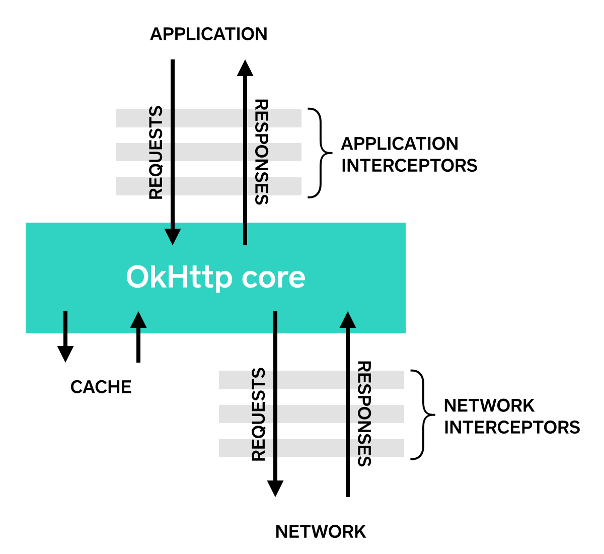

## 介紹

以往為了檢查 API 呼叫的 Request 或 Response 是否正確，都是土法煉鋼式的自行加註 `Log`。後來改用 Retrofit 之後，發現要加 `Log` 變得好麻煩，這才發現原來有 `HttpLoggingInterceptor` 可以自動印 Log 。

- [Java Doc: HttpLoggingInterceptor](https://square.github.io/okhttp/3.x/logging-interceptor/okhttp3/logging/HttpLoggingInterceptor.html)
- [How to log request and response body with Retrofit-Android?](https://stackoverflow.com/a/33328524/9982091)


> 👀 [OkHttp 的 Interceptors](https://square.github.io/okhttp/features/interceptors/) 介面有許多實作的類別，可以針對 API 呼叫做很多不一樣的事情，有興趣的讀者可以多利用這個關鍵字下去尋找相關的資料，本篇文章就不贅述。
> 

## 使用

### 1. add gradle dependency

```groovy
implementation 'com.squareup.okhttp3:logging-interceptor:4.9.0'
```

> 🚨 注意! 套件引用的版本，請以官方最新版本為準。

### 2. 新增 `HttpLoggingInterceptor` 到 `OkHttpClient`

```kotlin=
private fun getOkHttpClient(): OkHttpClient {

    val loggingInterceptor: HttpLoggingInterceptor =
        HttpLoggingInterceptor().setLevel(
            if (BuildConfig.DEBUG) {
                // Debug 模式下才開啟
                HttpLoggingInterceptor.Level.BODY
            } else {
                HttpLoggingInterceptor.Level.NONE
            }
        )

    return OkHttpClient.Builder()
        .addInterceptor(loggingInterceptor)
        // ...
        .build()
}
```

### 3. 正常呼叫 API Logcat 就會出現相關的 Log 囉

#### Level.NONE

什麼都不印

#### Level.BASIC

```
 --> POST /greeting http/1.1 (3-byte body)

 <-- 200 OK (22ms, 6-byte body)
```

#### Level.HEADERS

印 Request 跟 Response 的 Header。

```
 --> POST /greeting http/1.1
 Host: example.com
 Content-Type: plain/text
 Content-Length: 3
 --> END POST

 <-- 200 OK (22ms)
 Content-Type: plain/text
 Content-Length: 6
 <-- END HTTP
```

#### Level.BODY

Body & Header 全部都印

```
 --> POST /greeting http/1.1
 Host: example.com
 Content-Type: plain/text
 Content-Length: 3

 Hi?
 --> END POST

 <-- 200 OK (22ms)
 Content-Type: plain/text
 Content-Length: 6

 Hello!
 <-- END HTTP
```

## 常見問題

### 上傳大型檔案後出現閃退

公司專案中有一個需要上傳 01:30 長度的影片，檔案大小約 25MB。之前測試上傳都沒有問題，但在某測試版本中加上 `HttpLoggingInterceptor` 後，只要有影片的上傳都會閃退。

查詢 Firebase 與重現的錯誤都出現一樣的 `OutOfMemoryError`:

```
Fatal Exception: java.lang.OutOfMemoryError: Failed to allocate a 88561088 byte allocation with 25165824 free bytes and 69MB until OOM, target footprint 220477624, growth limit 268435456
       at okio.Buffer.readByteArray(Buffer.kt:1429)
       at okio.Buffer.readString(Buffer.kt:306)
       at okio.Buffer.readString(Buffer.kt:295)
       at okhttp3.logging.HttpLoggingInterceptor.intercept(HttpLoggingInterceptor.kt:209)
       at okhttp3.internal.http.RealInterceptorChain.proceed(RealInterceptorChain.kt:109)
       at com.tms.qpass.data.remote.TokenInterceptor.intercept(TokenInterceptor.kt:43)
       at okhttp3.internal.http.RealInterceptorChain.proceed(RealInterceptorChain.kt:109)
       at okhttp3.internal.connection.RealCall.getResponseWithInterceptorChain$okhttp(RealCall.kt:201)
       at okhttp3.internal.connection.RealCall$AsyncCall.run(RealCall.kt:517)
       at java.util.concurrent.ThreadPoolExecutor.runWorker(ThreadPoolExecutor.java:1167)
       at java.util.concurrent.ThreadPoolExecutor$Worker.run(ThreadPoolExecutor.java:641)
       at java.lang.Thread.run(Thread.java:923)
```


經查測後發現與 StackOverflow 上的這篇 [Upload large video file use Retrofit(Android) have OutOfMemoryError](https://stackoverflow.com/q/52270693/9982091) 相符。

既然問題是出在 `HttpLoggingInterceptor` 所產生的 `OutOfMemoryError`，那其實不一定要像 StackOverflow 上說的改成 `Level.NONE`，==只要不是設定 `Level.BODY` 都可以。==

調整設定後確定可以正常上傳。🤗

---

> 本文章同步發表在 [iT 邦幫忙](https://ithelp.ithome.com.tw/articles/10341913)、[HackMD](https://hackmd.io/@dh46tw/okhttp-HttpLoggingInterceptor)
