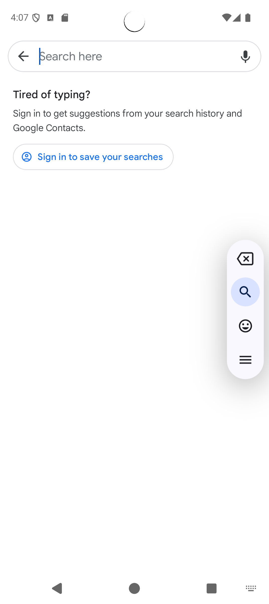
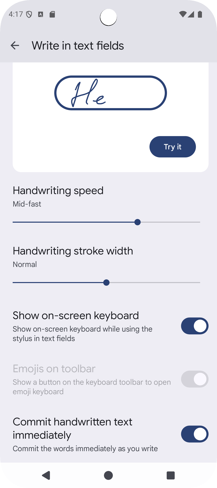
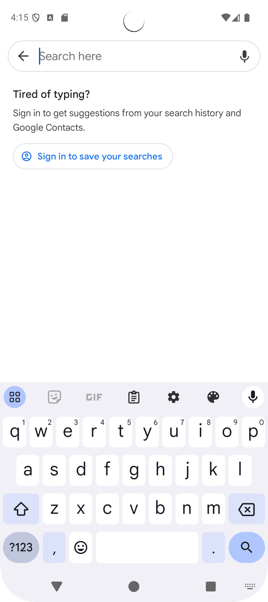

## 問題說明

在 Android Studio **Android 15 後的模擬器**中，預設情況下開啟鍵盤會看到這樣的畫面：

畫面上只有一個可拖曳的設定 UI，**卻沒有顯示任何鍵盤**。  
雖然你依然可以透過電腦實體鍵盤輸入文字，但若需要測試 **軟體鍵盤與 App UI 的互動**，就會非常不方便。

## 如何改回一般鍵盤顯示?

感謝 [StackOverflow: How can I make the Android emulator show the soft keyboard?](https://stackoverflow.com/a/79320172/9982091) 上的解答，可以透過以下方式啟用模擬器的 Soft Keyboard：

### 方法一：透過模擬器浮動選單

1. 在已點選輸入框的狀態下，點選模擬器畫面右側的 **垂直浮動工具列**，找到三條橫線並開啟選單，選擇 **Settings**。
2. 在 **Write in text fields** 頁面，滑動到下方，將 **Show on-screen keyboard** 設為「開啟」。  
3. 完成後，就能看到軟體鍵盤正常顯示。  

### 方法二：透過系統設定進入

若無法直接進入，可改用以下路徑：

1. 開啟 **系統設定 Settings**  
2. 點選 **System > Keyboard > On-screen keyboard**  
3. 選擇 **Gboard > Write in text fields**  
4. 開啟 **Show on-screen keyboard**  

完成設定後，鍵盤應該就會出現了：

---

## 結論

從 Android 15 (API 35) 開始，模擬器的 Soft Keyboard 預設不再自動顯示，需要手動啟用。  
只要依照上述步驟設定，就能恢復與以往相同的鍵盤輸入體驗，方便進行 UI 測試。
