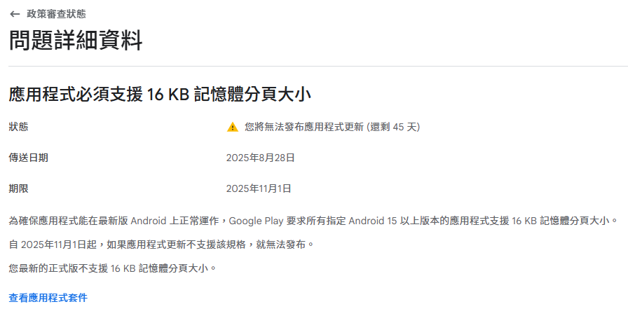
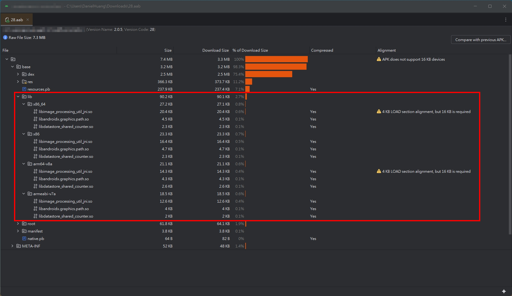
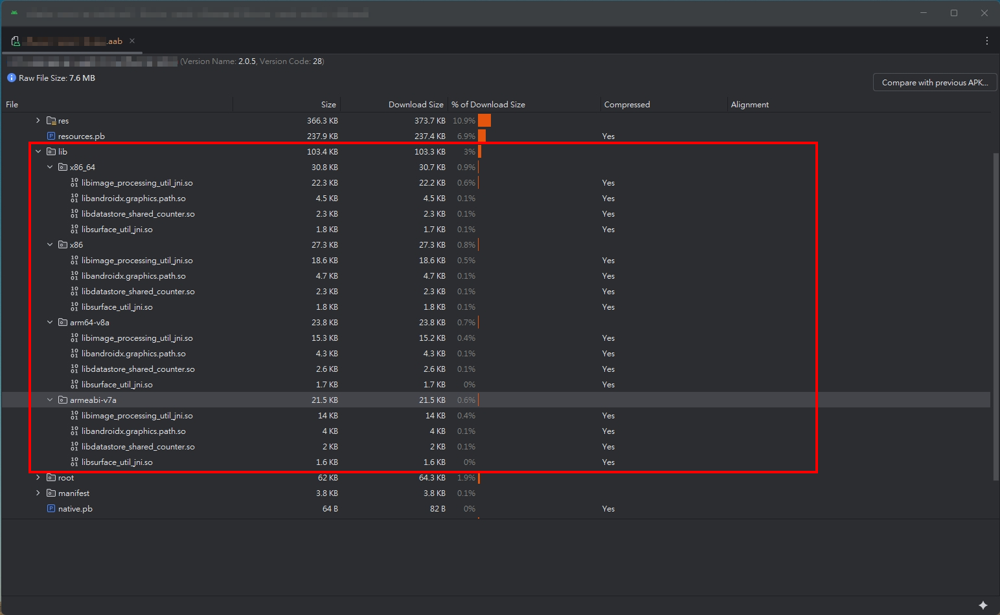
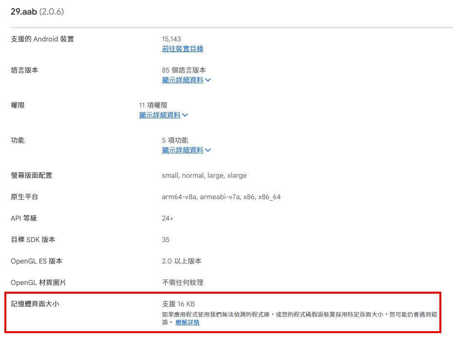

## 前言

最近應該不少 Android 開發者都有在 Google Play Console 收到一則關於 **16 KB 記憶體分頁大小 (page size)** 的政策審查通知。

依據官方文件，開發者有四種途徑可以檢查 App 是否支援 16 KB 記憶體分頁大小：

1. 確認是否有使用 Native Code。
	- 如果完全沒有使用，基本上預設會是支援的狀態。
2. 使用 Android Studio 中的 [APK Analyzer](https://developer.android.com/guide/practices/page-sizes?hl=zh-tw#identify-native-code)。
3. 依靠 Android Studio [編譯階段時的自動提醒](https://developer.android.com/guide/practices/page-sizes?hl=zh-tw#auto-checks)。
4. 透過 [Command-Line 工具](https://developer.android.com/guide/practices/page-sizes#alignment-use-tools) 。

就我手上維護的專案來說，有些使用了第三方 Native Code Libs，另一些則是 Android 官方提供的 (例如 [CameraX](https://developer.android.com/media/camera/camerax?hl=zh-tw) )。

## 問題

在實際用 APK Analyzer 檢查的時候，我發現了一個狀況。

**Google Play Console 顯示結果與本地檢查不一致**

> 使用環境：Android Studio Meerkat | 2024.3.1 。

Google Play Console 明確指出 `libimage_processing_util_jni.so` 不支援 16 KB ，但不管是檢查 APK 還是 AAB ， APK Analyzer 都沒有指出有 lib 不支援。

## 除錯過程

丟了幾個關鍵字查資料，找到兩個比較相關的討論

- [StackOverflow - Android- Problem with support of 16KB sizes - dump_syms.bin](https://stackoverflow.com/a/79760529/9982091) 
- [StackOverflow - The '16 KB page sizes' issue wasn't resolved, even though the bundle details indicated that the latest version supports 16 KB page size](https://stackoverflow.com/questions/79754556/the-16-kb-page-sizes-issue-wasnt-resolved-even-though-the-bundle-details-ind)

### 嘗試另一種方法：`Run Inspection By Name`

StackOverflow 的討論串裡有人提到，除了 APK Analyzer，也可以用 Android Studio 的 `Analyze Code` 來檢查：

> **Code -> Analyze Code -> Run Inspection by Name -> Search for "16 kb"**

實測後，這個方法同樣沒有檢查到不符合的 Libs 。

#### 補充案例

我另外測試了一個確定有使用 4 KB Alignment Libs 的專案，結果是：

- **APK Analyzer** → 顯示已 16 KB Aligned
- **Analyze Code** → 顯示存在 4 KB Aligned 的 Libs

這代表 Android Studio 提供的工具，其檢測的結果不一定可靠。

### Android Studio APK Analyzer 的 Bug

> _Yesterday I spent hours debugging my Flutter app. The `.aab` looked fine in Android Studio, but both the emulator (16kb) and Play Console showed errors. The issue is a bug in Android Studio Narwhal 2025.1.2, where AAB alignment isn’t checked properly (APKs are fine)._
> 
> [StackOverflow - Android- Problem with support of 16KB sizes - dump_syms.bin](https://stackoverflow.com/a/79760529/9982091)

> 1. _Even if you fix all the libraries, there is a bug in Android Studio Narwhal | 2025.1.1 and 2025.1.2 and APK Analyzer says that your app do not support 16 KB alignment on app level._
> 2. _In Android Studio Narwhal | 2025.1.3 the bug is "fixed" so that now APK analyzer is not showing warnings even for the problematic libraries. :) If you already have Android Studio Narwhal | 2025.1.3, you'll have to downgrade it or wait for a newer version where the APK Analyzer is really fixed._
> 
> [StackOverflow - The '16 KB page sizes' issue wasn't resolved, even though the bundle details indicated that the latest version supports 16 KB page size](https://stackoverflow.com/questions/79754556/the-16-kb-page-sizes-issue-wasnt-resolved-even-though-the-bundle-details-ind)

綜合 StackOverflow 上的討論內容，可以推測 **Android Studio 的 APK Analyzer 在某些版本有 Bug**。

- Narwhal 2025.1.1 ~ 2025.1.2：無論專案是否修正，檢查結果都可能錯誤。
- Narwhal 2025.1.3：APK Analyzer 可能會直接忽略問題 Libs，讓結果「看起來正常」。

> 查詢 Android Studio Narwhal 2025.1.3 的[版本更新說明](https://developer.android.com/studio/releases/fixed-bugs/studio/2025.1.3#android-studio-narwhal-feature-drop-|-2025.1.3-canary-2) ，雖然有提到針對 16 KB 檢測的修正，但細節跟 StackOverflow 上的討論又有些不同。

### 更新至最新版 Android Studio Narwhal 3 Feature Drop | 2025.1.3 

既然網路上查到的資料都沒有一個定案，不如就實際更新到 Narwhal 3 Feature Drop | 2025.1.3 來試試。
實際測試後發現，APK Analyzer 的檢查有正確顯示，並沒有 StackOverflow 上提的問題。

#### 實測結果

|      狀態      | APK Ananlyzer on Narwhal 3 Feature Drop \| 2025.1.3 |
| :----------: | :-------------------------------------------------: |
| 修正 16 KB 問題前 |         |
| 修正 16 KB 問題後 |          |

|               Google Play Console 檢查結果               |
| :----------------------------------------------------: |
|  |

在 **Narwhal 3 Feature Drop | 2025.1.3** 測試，結果與 Google Play Console 一致，顯示支援 16 KB。

## 結論

如果你也遇到 **APK Analyzer 與 Google Play Console 顯示結果不一致**的情況，而 Android Studio 剛好是上面提到的幾個問題版本，也許可以試著更新至 **Narwhal 3 Feature Drop | 2025.1.3** ，或其他更新的版本。

但要注意，App 最終是否支援 16 KB Page Size，**仍是以上傳到 Google Play Console 後的檢查結果為準**。實際上線前也別忘了在支援 16KB Page Size 的裝置上測過，避免在執行時出現非預期的錯誤。

以上就是這次的經驗分享，歡迎在留言區分享你遇到的狀況。

掰！👋
