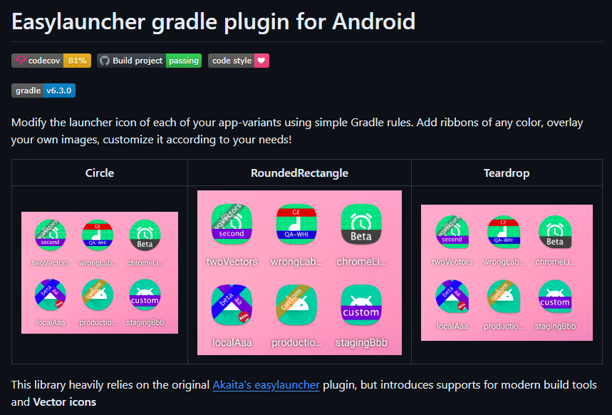

## 前言

在 Android 開發中，專案預設會有 `debug` 和 `release` 這兩種 build type，用來區分開發環境與正式環境。根據專案規模與開發流程，有些團隊甚至會進一步細分為 `alpha`、`beta` 等不同的 build variant，用以區隔開發的不同階段。

對開發者或測試人員來說，在測試機上同時安裝好幾個版本的 App 是稀鬆平常的事。但問題來了──怎麼快速分辨桌面上哪個 App 是哪個版本？

這時候就有兩個選項可以幫上忙：**改 App 名稱** 或是 **換 Icon**。  
改名稱其實很簡單，只要在對應 variant 的 `strings.xml` 裡覆寫 `app_name` 就搞定了。

至於換 App Icon，雖然理論上可以透過資源目錄的變體（例如 `mipmap-debug`）手動準備不同版本的 Icon，但這樣不僅麻煩，還得準備好幾套圖示，光想就頭痛。

`easylauncher-gradle-plugin` 就是專門為這種情境設計的工具。

## easylauncher-gradle-plugin 介紹

[usefulness/easylauncher-gradle-plugin](https://github.com/usefulness/easylauncher-gradle-plugin) 是一款可以自動幫你的 App Icon 加上標記（Ribbon）的 Gradle Plugin，能依據不同的 build type 或 variant 自動套用樣式。

你可以自由設定 ribbon 的**文字、顏色、位置與樣式**，也支援使用圖片當作覆蓋圖層，功能非常齊全。最棒的是──**完全自動化，不需要額外準備 Icon**！



## 快速上手

以下是快速設定的方式，如果你想要深入客製化，推薦直接參考官方的 [GitHub 文件](https://github.com/usefulness/easylauncher-gradle-plugin)。  

### 使用 Kotlin DSL（KTS）搭配 libs.versions.toml

#### `libs.versions.toml`

```toml
[versions]
easylauncher = "6.4.1"

# 略...

[plugins]
# 開發版 Icon
easylauncher = { id = "com.starter.easylauncher", version.ref = "easylauncher" }
```

#### `build.gradle.kts` (module-level)

```kotlin
plugins {
	// ...
	alias(libs.plugins.easylauncher)
}

// ...

easylauncher {  
    buildTypes {  
        create("debug") {
            setFilters(chromeLike("dev"))  
        }  
    }
}
```

📢 如果沒有特別設定 ribbon 樣式，預設會加上一個淡綠色的 ribbon，文字會是目前的 build type 或 variant 名稱。

### 使用 Groovy DSL

#### `build.gradle` (module-level)

```groovy=
plugins {
    // ...
    id "com.starter.easylauncher" version "6.4.1"
}

// 略...

// 設定 easylauncher 樣式
easylauncher {
    buildTypes {
        debug {
            filters chromeLike(label: "dev")
        }

        release {
	        // 通常 release 版不會加 ribbon
        }
    }
}
```

不論你是使用 Kotlin DSL 還是 Groovy DSL，基本上照著上面設定好，再重新 Build 一次並安裝到測試機上，就能看到 App Icon 上有醒目的 ribbon 標記啦！

如果過程中遇到錯誤，可以試著執行 `Clean Project` 或 `Invalidate Caches & Restart`，通常都能解決。  真的還不行的話，也歡迎留言討論，我們一起 debug 起來～ 💪 

如果你對 App 多版本管理有興趣，或是希望開發流程更有辨識度，這套 plugin 絕對值得試試看。  
