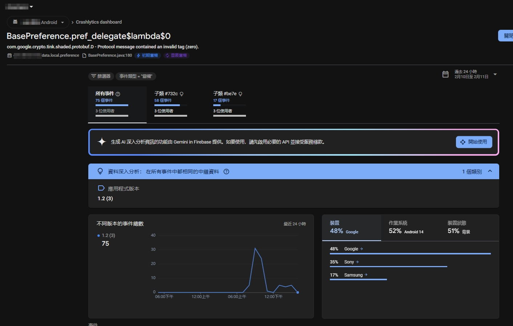

## 一、問題描述

```
使用者的手機為 Sony 品牌，首次安裝 App 時，系統版本為 Android 14，能夠正常使用。  
近期系統升級為 Android 15 後，開啟 App 即閃退。即使移除後重新安裝，仍然無法使用。
```

## 二、查看錯誤事件



查找 Crashlytics 上的錯誤事件，全部事件只有兩筆，其中只有 `BasePreference.pref_delegate$lambda$0` 這筆看起來最為相關。
查看錯誤訊息的內容，確認是在實例化 `EncryptedSharedPreference` 時出了問題。

> 程式裡實例的方式是參考 [Android 開發 | 加密版的 SharedPreference - EncryptedSharedPreferences](/../posts/2021/android-encryptedsharedpreferences/)。

```
Fatal Exception: com.google.crypto.tink.shaded.protobuf.D: Protocol message contained an invalid tag (zero).
       at com.google.crypto.tink.shaded.protobuf.InvalidProtocolBufferException.<init>(InvalidProtocolBufferException.java:100)
       at com.google.crypto.tink.shaded.protobuf.GeneratedMessageLite.parsePartialFrom(GeneratedMessageLite.java:100)
       at com.google.crypto.tink.shaded.protobuf.GeneratedMessageLite.parseFrom(GeneratedMessageLite.java:100)
       at com.google.crypto.tink.proto.Keyset.parseFrom(Keyset.java:3)
       at com.google.crypto.tink.integration.android.SharedPrefKeysetReader.read(SharedPrefKeysetReader.java:67)
       at com.google.crypto.tink.CleartextKeysetHandle.read(CleartextKeysetHandle.java:67)
       at com.google.crypto.tink.integration.android.AndroidKeysetManager$Builder.read(AndroidKeysetManager.java:67)
       at com.google.crypto.tink.integration.android.AndroidKeysetManager$Builder.readOrGenerateNewKeyset(AndroidKeysetManager.java:67)
       at com.google.firebase.messaging.GmsRpc.i(GmsRpc.java:17)
       at androidx.security.crypto.EncryptedSharedPreferences.create(EncryptedSharedPreferences.java:180)
       at 

// ...
```

錯誤訊息 `Fatal Exception: com.google.crypto.tink.shaded.protobuf.D: Protocol message contained an invalid tag (zero).` [InvalidProtocalBufferException](https://protobuf.dev/reference/java/api-docs/com/google/protobuf/InvalidProtocolBufferException.html) 代表 **解密資料時解析 protobuf 格式失敗**，通常是因為解密出的內容是無效的（可能是空的或亂碼）。
## 三、分析問題

嘗試在不同的系統版本中測試，皆未能還原相同的錯誤。只能就錯誤訊息推敲，並查詢 Google 與搭配 AI 工具輔助。
### 3-1 套件版本問題

如果把錯誤訊息的關鍵字餵給 Google，前幾篇 StackOverflow 幾乎都導回 [StackOverflow: Caused by: com.google.crypto.tink.shaded.protobuf.InvalidProtocolBufferException: Protocol message contained an invalid tag (zero)](https://stackoverflow.com/a/75445532/9982091)這篇，而這篇討論下的回覆又帶到了 Google 的 IssueTracker。

看過 IssueTracker 後，會發現類似問題已被回報多次，大致上都在以下這三條 Issues 裡：

1. [IssueTracker:  InvalidProtocolBufferException on initialization on some devices](https://issuetracker.google.com/issues/164901843#comment79) 
2. [Bug: using EncryptedSharedPreferences, it can cause crashes to users right when initializing it](https://issuetracker.google.com/issues/176215143)
3. [Lots of decryption errors after updating to AndroidX Security 1.0.0 RC 2](https://issuetracker.google.com/issues/158234058)

細看這些討論串後發現，問題從一開始的 1.0.0 到 1.1.0-alpha06 版本都存在，官方似乎也沒有提供比較完整的解決辦法。

另外，以目前 App 的使用者所遭遇到的情況，大部分的使用者沒有遇到相同問題，只有與前述情境吻合的人才有發生錯誤。**所以套件版本應該不是造成此次錯誤的原因。**
### 3-2 allowBackup 問題

在討論串中，有人提出了將 AndroidManifest 中的 `android:allowBackup`  設為 `false` 可以暫時解決此問題。不確定為何這個會跟有關

> [!info] Android  的 Auto Backup
> Auto Backup 是 Android 提供的兩種備份機制之一。
> 從 Android  6.0 開始支援，每個 App 有 25MB 的備份空間。
> 系統會將資料備份到使用者的 Google Drive 空間。
 
[Auto-Backup 會備份的資料](https://developer.android.com/identity/data/autobackup#Files) 包含：
- **SharedPreference 檔案**
- 儲存在 App 內部空間且可由 `getFileDir()`、`getDir(String, int)` 存取的檔案。
- 儲存在 `getDatabasePath(String)` 路徑下的 SQLite 檔案。（包含由 `SQLiteOpenHelper` 建立的檔案。）
- 儲存在 `getExternalFileDir(String)` 路徑下的檔案。

EncryptedSharedPreference 的文件，也說明開發者應該要將 EncryptedSharedPreference 建立的檔案排除在 Auto Backup 機制外。

> **WARNING**: The preference file should not be backed up with Auto Backup. When restoring the file it is likely the key used to encrypt it will no longer be present. You should exclude all `EncryptedSharedPreference`s from backup using [backup rules](https://developer.android.com/guide/topics/data/autobackup#IncludingFiles).
>  [Doc: EncryptedSharedPreference](https://developer.android.com/reference/androidx/security/crypto/EncryptedSharedPreferences)

我目前專案裡的 `allowBackup` 確實忘了改為 `false`，也沒有寫例外規則將檔案排除在備份外。
**看起來這個比較是問題的主因。**

### 3-4 EncryptedSharedPreference 的運作機制

```
[應用程式存取 EncryptedSharedPreferences]
            │
            ▼
[檢查 MasterKey 是否存在於 KeyStore]
     ┌───────────────┬───────────────┐
     │ 存在          │ 不存在        │
     ▼               ▼
[使用 MasterKey]   [建立新的 MasterKey]
     │               │
     ▼               ▼
[讀取/寫入 EncryptedSharedPreferences]
     │
     ▼
[加密 Key & Value]
     │
     ▼
[存入 shared_prefs/*.xml]
```
## 四、推論與測試

### 4-1 推測

錯誤有可能是以下兩種原因造成的：
#### 系統升級後，KeyStore 內的 MasterKey 金鑰變更或遺失。

原本存在 KeyStore 內的 MasterKey 可能已經無法使用，導致解密失敗。

```
[應用程式開啟 → 嘗試讀取 EncryptedSharedPreferences]
            │
            ▼
[從 KeyStore 取得 MasterKey]
     ┌───────────────┬───────────────┐
     │ 存在          │ 不存在        │
     ▼               ▼
[使用 MasterKey]   [無法解密 → 錯誤]
     │               │
     ▼               ▼
[解密 Key & Value]  [App Crash]
     │
     ▼
[成功讀取資料]
```

#### 使用者刪除後重新安裝，但因為 `allowBackup=true`，EncryptedSharedPreferences 被自動恢復。

```
[使用者刪除 & 重新安裝 App]
            │
            ▼
[系統自動還原 EncryptedSharedPreferences (XML)]
            │
            ▼
[嘗試使用舊的 MasterKey 解密]
     ┌───────────────┬───────────────┐
     │ MasterKey 存在│ MasterKey 遺失│
     ▼               ▼
[成功解密]      [無法解密 → Crash]
                   │
                   ▼
           [解決方案：清除 App 資料]
```

由於 `allowBackup=true`，Android 的 Auto Backup 會自動備份 `EncryptedSharedPreferences` 的 XML 檔案，但不會備份 KeyStore 內的金鑰。 

當 App 重新安裝後，EncryptedSharedPreferences 的加密資料仍然存在，但對應的 MasterKey 已遺失，導致無法解密，產生錯誤。
### 4-2 測試

同事的測試機剛好有遇到相同的問題，請他以下列步驟手動排除：

1. 將 App 從 Google Play 上載回。
2. 手動進入系統設定，清除 App 的資料與快取。
3. 重新開啟 App。此時已可正常進入 App 登入畫面。  

使用清除 App 資料與快取的方法後，問題順利解決。這進一步驗證了 `allowBackup` 導致 `EncryptedSharedPreference` 被錯誤還原，而 KeyStore 中的 MasterKey 並未一併恢復，導致解密失敗。
## 結論

如果問題的發生情境與條件滿足以下：

- 錯誤是在使用者安裝且升級系統後發生。
- App 的備份設定是`android:allowBackup="true"` ，且未替 `EncryptedSharedPreference` 產生的 `xml` 加上例外條件。

那麼你很有可能跟我遇到的是同樣的問題。
### 解決方案

我最後的解決方案是：

1. 將 `AndroidManifest` 的 `allowBackup` 設為 `false`，或將 EncryptedSharedPreference 產生的檔案加入例外條件。（細節可以參考[官方文件](https://developer.android.com/identity/data/autobackup#IncludingFiles)）
2. 將 `EncryptedSharedPreference` 的初始化加上 `try-catch` 捕捉解密失敗的錯誤。失敗時，清除已損壞的 `.xml`，並加上 retry 機制重新建立新的資料。

```kotlin
private fun createEncryptedSharedPreference(  
    preferenceName: String,  
    context: Context  
): SharedPreferences {  
    val masterKeys = MasterKeys.getOrCreate(MasterKeys.AES256_GCM_SPEC)  
    return retryWithFallback(2,  
        onFailure = { context.deleteSharedPreferences(preferenceName) }  
    ) {  
        EncryptedSharedPreferences.create(  
            preferenceName,  
            masterKeys,  
            context,  
            EncryptedSharedPreferences.PrefKeyEncryptionScheme.AES256_SIV,  
            EncryptedSharedPreferences.PrefValueEncryptionScheme.AES256_GCM  
        )  
    }  
}

private inline fun <T> retryWithFallback(  
    maxRetryCount: Int,  
    onFailure: () -> Unit,  
    block: () -> T  
): T {  
    var attempts = maxRetryCount  
    while (attempts > 0) {  
        try {  
            return block()  
        } catch (e: Exception) {  
            Timber.e(e)  
            if (attempts <= 1) throw e  
            onFailure()  
        }  
        attempts--  
    }  
    throw IllegalStateException("Retry failed after $maxRetryCount attempts")  
}
```

當然，最根本的解決辦法，是在一開始使用 EncryptedSharedPreference 時，就要關閉 Auto-Backup 或加入例外規則，才能避免這個問題重複發生。
