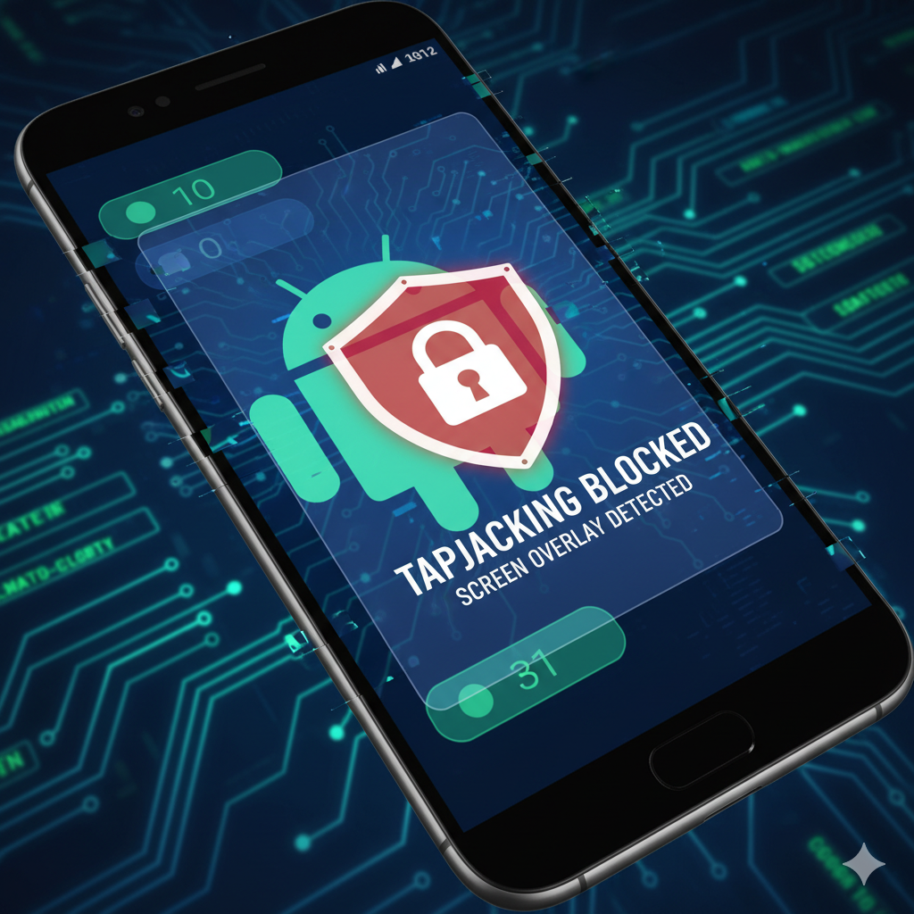
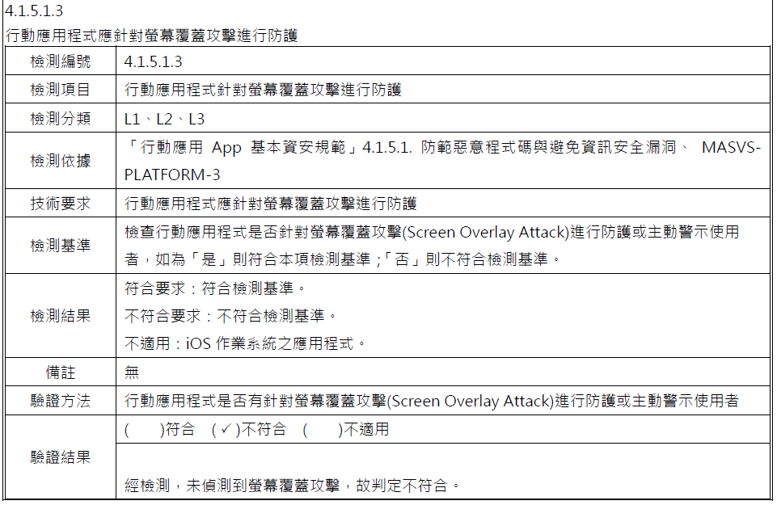
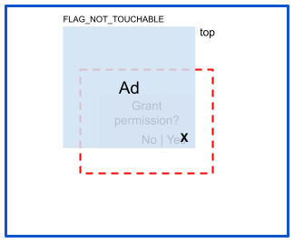
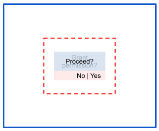

今年度的資安檢測基準新增了「螢幕覆蓋攻擊」的檢測項目。剛好最近送測的專案也因此被點出不符規範，加上後續的專案預期都會受到影響，因此特別整理這篇筆記，讓自己能快速掌握概念，並理解各種防護方式的實作細節。



## 什麼是螢幕覆蓋攻擊（Screen Overlay Attack）？

|||
|:----:|:----:|

> _圖片來源: [Android Doc - Privacy and Security - Tapjacking](https://developer.android.com/privacy-and-security/risks/tapjacking)_

根據 [行動應用資安聯盟](https://www.mas.org.tw/) - [行動應用App基本資安檢測基準V4.0](https://s3.ap-northeast-1.amazonaws.com/www.mas.org.tw/public/files/25533/original/2209977668634d53b40a0.pdf) 裡的描述：  

**攻擊者的應用程式會在行動應用程式上繪製一個視窗，誤導使用者將自己點擊的入侵視窗當作正常視窗。**

換句話說，螢幕覆蓋攻擊本質上就是「用一層假的 UI 蓋住真的 UI」。攻擊者可能會模擬系統警示框、模擬 App 畫面，或做成任何能誘導操作的浮動視窗。

在網頁領域，它的行為類似 **[ClickJacking](https://en.wikipedia.org/wiki/Clickjacking)**；而在 Android 官方文件中，這類攻擊則被稱為 [Tapjacking](https://developer.android.com/privacy-and-security/risks/tapjacking?hl=zh-tw)。

## 如何避免 App 遭遇螢幕覆蓋攻擊？

理解攻擊手法後，防範策略可以分成這幾個方向：

1. 避免 App 不被其他 App 遮蔽。
2. 在 App 畫面被遮蔽時，使觸控事件無效。
3. ~~🙃 警告使用者不要亂安裝奇怪的東西跟亂給權限… 🙃~~

以下整理幾種常見、有效、並且可依系統版本選擇的防護方式。

### 方法一、`WindowManager.LayoutParams.FLAG_SECURE`

- 支援版本：API 1 起即可使用。
- 效果：阻止 Overlay、阻止截圖、阻止投影。

```kotlin
// 禁止其他程式於上層繪製 / 禁止截圖 / 禁止投影  
activity.window.setFlags(  
    WindowManager.LayoutParams.FLAG_SECURE,  
    WindowManager.LayoutParams.FLAG_SECURE  
)
```

在 `Activity.onCreate()` 加上上述設定後，不僅可以防止 Overlay，也會一併禁止截圖與投影。這也是許多銀行、醫院等高資安需求 App 的常見做法。

### 方法二、 `Window.setHideOverlayWindows(true)`

- 支援版本：Android 12 (API 31) 以上
- 效果： 阻止所有非系統 Overlay

```kotlin
/**  
 * [資安檢測項目] TapJacking  
 * 強制移除非系統的 Overlay UI  
 * 避免惡意程式以浮動 UI 混淆使用者操作  
 *  
 * @param activity  
 */  
private fun setHideOverlayWindows(activity: Activity) {  
    if (Build.VERSION.SDK_INT >= Build.VERSION_CODES.S) {  
        // 啟用此功能，防止非系統浮層繪製在此視窗上  
        activity.window.setHideOverlayWindows(true)  
    }  
}
```

這個方法的效果與方法一類似，但不會影響截圖與投影功能。如果你的 App 不希望完全禁止截圖，Android 12+ 裝置可以優先採用這個方法。

### 方法三、`android:filterTouchesWhenObscured="true"`

- 支援版本： Android 9 (API 28) 以前建議採用
- 效果： 在 View 被遮蔽時，忽略觸控事件

```xml
<com.google.android.material.button.MaterialButton  
    android:id="@+id/btn_one_click"
    android:filterTouchesWhenObscured="true" />
```

啟用後，只要該 View 偵測到自己被 Overlay 遮蔽，就會自動忽略觸控事件，避免使用者在不知情的情況下點擊錯誤的 UI。

如果只是要防止 TapJacking 引發預期外的 App 行為，可以直接針對敏感 UI 元件設定這個參數就可以了。

如果覺得一個一個設定很麻煩，可以在 `style.xml` 中統一設定，再套用到 UI 元件上。

### 方法四、覆寫 `View.onFilterTouchEventForSecurity()`

`filterTouchesWhenObscured` 背後的底層邏輯，就是由這個方法負責。  
當 `onFilterTouchEventForSecurity()` 回傳 `false` 時，代表觸控事件發生時，畫面有被遮蔽。

以下是其預設實作：

```java
/**  
 * Filter the touch event to apply security policies.  
 *  
 * @param event The motion event to be filtered.  
 * @return True if the event should be dispatched, false if the event should be dropped.  
 *  
 * @see #getFilterTouchesWhenObscured  
 */  
public boolean onFilterTouchEventForSecurity(MotionEvent event) {  
    //noinspection RedundantIfStatement  
    if ((mViewFlags & FILTER_TOUCHES_WHEN_OBSCURED) != 0  
            && (event.getFlags() & MotionEvent.FLAG_WINDOW_IS_OBSCURED) != 0) {  
        // Window is obscured, drop this touch.  
        return false;  
    }  
    return true;  
}
```

透過覆寫這個方法，開發者可以：

- 在偵測到畫面遭遮蔽時提示使用者
- 紀錄 Log 以協助除錯
- 執行專案內必要的安全措施

以下程式碼範例，就是在事件觸發當下，顯示 Toast 提示使用者。

```kotlin
override fun onFilterTouchEventForSecurity(event: MotionEvent?): Boolean {  
    val noOverlayDetected = super.onFilterTouchEventForSecurity(event)  
    if (!noOverlayDetected) {  
        Toast.makeText(  
            context,  
            R.string.toast_tapjacking_detected,  
            Toast.LENGTH_SHORT).show()  
    }  
    return noOverlayDetected  
}
```

## 個人實務經驗分享

此次需要修改的 App 具備以下條件：

1. 大量客製化 UI
2. 採用 Single Activity + 多 Fragment 架構
3. 資安送檢時間緊迫，需要快速交付

最終採用以下方案：

1. Android 12+：使用方法二 `Window.setHideOverlayWindows(true)`
2. Android 12 以下： 使用方法三 + 方法四 的組合

我建立了一個自訂 ViewGroup `SecureConstraintLayout`，負責統一處理遮蔽與提示邏輯：

```kotlin
import android.content.Context  
import android.util.AttributeSet  
import android.view.MotionEvent  
import android.widget.Toast  
import androidx.constraintlayout.widget.ConstraintLayout  
import com.emct.newagriculturaldisaster.R  
  
/**  
 *  Created by DanielHuang on 2025/11/13
*/ 
class SecureConstraintLayout @JvmOverloads constructor(  
    context: Context, attrs: AttributeSet? = null  
) : ConstraintLayout(context, attrs) {  
  
    init {  
        filterTouchesWhenObscured = true  
    }  
  
    override fun onFilterTouchEventForSecurity(event: MotionEvent?): Boolean {  
        val noOverlayDetected = super.onFilterTouchEventForSecurity(event)  
        if (!noOverlayDetected) {  
            Toast.makeText(  
                context,  
                R.string.toast_tapjacking_detected,  
                Toast.LENGTH_SHORT).show()  
        }  
        return noOverlayDetected  
    }  
}
```

如此一來，只要使用該自訂 ViewGroup 包住敏感 UI，就能確保在被遮蔽時給予即時提示，提高整體安全性。

## 總結

以上就是我在 Android 上處理螢幕覆蓋攻擊的整理與實作心得。
如果你最近也在面對相同的資安檢測項目，希望這篇文章能幫你省下一些摸索時間。
如果內容有不足或更好的作法，也非常歡迎留言交流。

感謝你的閱讀，下次見 👋

## 參考資料

- [Android Doc - Privacy and Security - Tapjacking](https://developer.android.com/privacy-and-security/risks/tapjacking)
- [鑒真數位的 Facebook 貼文](https://www.facebook.com/photo.php?fbid=973159521485249&id=100063736312782&set=a.480780450723161&locale=zh_TW)
- [鑒真數位的 Blog](https://iforensicsblog.blogspot.com/2024/07/blog-post.html)
- [OWASP 介紹如何檢測 Tap Jacking](https://mas.owasp.org/MASTG/tests/android/MASVS-PLATFORM/MASTG-TEST-0035/)
- [Android Doc 保護敏感活動](https://developer.android.com/security/fraud-prevention/activities?hl=zh-tw)
- [Medium What is Tapjacking in Android and How to Prevent It](https://medium.com/devknoxio/what-is-tapjacking-in-android-and-how-to-prevent-it-50140e57bf44)
- [Medium Android 12 — App Overlay Controls?](https://buraksinankarabulut.medium.com/android-12-app-overlay-controls-d9a568b31d4d)
