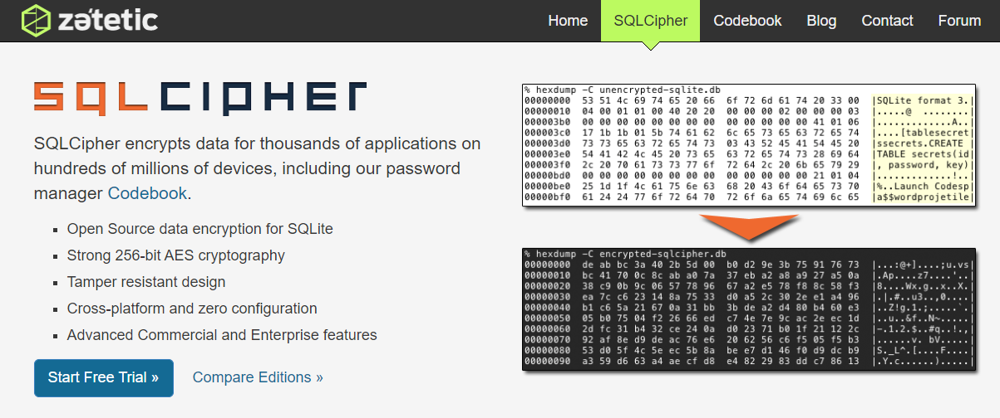
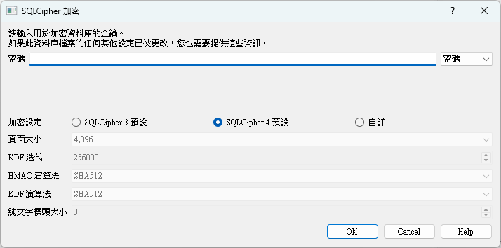
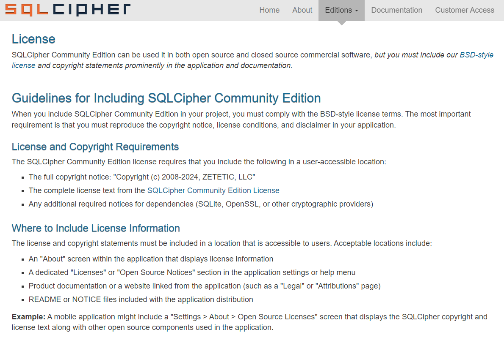

## 前言

對，又是資安檢測。XD

前一篇 [Android 資安 | 螢幕覆蓋攻擊（Tapjacking）防護筆記](../android-screen-overlay-attack-tapjacking-prevention/) 就是因為資安檢測所做的調整，而這次被檢測出來的項目，是 _4.1.2.3.4 行動應用程式應避免在關閉及登出後將敏感性資料儲存於冗餘檔案或日誌檔案中_。

報告的詳細說明指出，App 本地儲存的 SQLite 資料庫檔案，被檢測出包含使用者的敏感資訊（如行動電話號碼）。按照報告的步驟，確實能輕易地從資料庫檔案中讀取到這些未經保護的資料。

要讓檢測單位篩檢不出敏感資訊的方法有很多，例如只針對敏感資料欄位加密。但考量到 App 尚處於開發階段，同時提早因應未來可能會越來越嚴格的資安標準，直接將整個 SQLite 資料庫加密，似乎是更好的方法，

廢話不多說，我們就來看看如何在 Android 上，使用 SQLCipher 為 Room 資料庫進行加密吧~
## 什麼是 SQLCipher

首先，先認識一下本篇文章的主角，SQLCipher。



SQLCipher 是由 Zetetic 公司所開發與維護的 SQLite 加密套件，它透過簡單的擴充，為 SQLite 資料庫提供了透明、可靠的加密層。

它的主要特性包含：

- **透明加解密**：在資料讀取與寫入時，SQLCipher 會在背景自動進行加解密，開發者無需修改原有的 SQL 查詢邏輯。
- **可靠的加密演算法**：採用 AES-256 位元演算法，這是目前公認的安全標準。
- **頁面級加密**：對資料庫的每一頁（Page）獨立加密，確保資料的完整性與安全性。
- **跨平台支援**：支援 Android, iOS, .NET, macOS, Linux 等多個平台。
- **彈性的授權**：[免費的社群版到功能更豐富的付費商用版](https://www.zetetic.net/sqlcipher/#feature-comparison)都有，開發者可根據專案需求選擇。

大概認識 SQLCipher 後，就來看看在 Android 上該如何與 Room 搭配實作吧！

## 整合 SQLCipher 與 Room

### 步驟 1：加入 Gradle 依賴

首先，在 `app` module 的 `build.gradle.kts` 或 `build.gradle` 檔案中，加入 SQLCipher 的依賴。

```groovy
dependencies {
	// SQLite Encryption  
	implementation 'net.zetetic:sqlcipher-android:4.11.0'
}
```

這裡有兩件事情要留意。

1. 有些比較舊的文章是介紹 [sqlcipher/android-database-sqlciper](https://github.com/sqlcipher/android-database-sqlcipher)，但它是已經被棄用的函式庫，請一律改用 [sqlcipher/sqlcipher-android](https://github.com/sqlcipher/sqlcipher-android)。
2. 為了支援 Google Play 16KB 的政策更新，請選擇 `4.6.1` 以後的版本。[參考資料](https://github.com/sqlcipher/sqlcipher-android/issues/71)。

### 步驟 2：載入 Native Library

在存取任何 SQLCipher 的 API 之前，必須先載入其底層的 C++ 函式庫。最佳的執行時機點，是在建立資料庫實體之前。若是使用 Hilt 或 Koin 等 DI 框架，可以放在提供資料庫實體的 `provide` 方法中。

```kotlin
import android.app.Application  
import androidx.room.Room  
import androidx.room.RoomDatabase

import dagger.Module  
import dagger.Provides  
 
import javax.inject.Singleton

@Provides  
@Singleton  
fun provideSampleDatabase(app: Application): SampleDatabase {  
    // 載入 SQLCipher 的 native library
    System.loadLibrary("sqlcipher")
    
    // Room 初始化 略... 
}
```

### 步驟 3：設定加密密碼並建立 Room 資料庫

要啟用加密，我們需要建立一個 `SupportOpenHelperFactory` 物件，並將加密密碼傳入，最後再透過 `RoomDatabase.Builder.openHelperFactory()` 方法將其設定給 Room。

> ⚠️ 有關加密的密碼  
> 
> 下方的範例是為了方便說明。在正式產品中，**絕對不應**將密碼以明文方式儲存在程式碼裡。
> 應該將密碼儲存 Android KeyStore 等受保護且安全的儲存環境，或者採取其他手段保護。

```kotlin
import android.app.Application  
import androidx.room.Room  
import androidx.room.RoomDatabase

import net.zetetic.database.sqlcipher.SupportOpenHelperFactory

import dagger.Module  
import dagger.Provides  
 
import javax.inject.Singleton

/**
 * 建立 SQLCipher 的 SupportOpenHelperFactory
 */
private fun getSupportFactory(): SupportOpenHelperFactory {
	// 這裡的密碼勿明碼與 Hard coded
	val password = "YOUR_SAFE_PASSWORD"
	return SupportOpenHelperFactory(password)
}

@Provides  
@Singleton  
fun provideSampleDatabase(app: Application): SampleDatabase {  
    // 載入 SQLCipher 的 native library
    System.loadLibrary("sqlcipher")
    
    // 取得加密密碼（此處應替換為安全的密碼管理機制）
    val passphrase = "YOUR_VERY_SAFE_PASSWORD".toByteArray()
    val factory = SupportOpenHelperFactory(passphrase)
    
    return Room  
        .databaseBuilder(  
            app,  
            SampleDatabase::class.java,  
            SampleDatabase.DB_NAME  
        )
        .openHelperFactory(factory) // 設定 SQLCipher Factory
        .build()  
}
```

完成以上步驟後，Room 資料庫在建立時就會自動加密了。

## 驗證加密是否成功

### 處理現有的未加密資料庫

整合 SQLCipher 後，如果 App 中已存在同名的**未加密**資料庫檔案，程式在啟動時會因無法解密而拋出 `SQLiteException` 錯誤。

- **對於新安裝的 App**：不會有任何問題，程式會直接建立新的加密資料庫。
- **對於已存在的 App**：除非是沒有需要保留資料，否則都會需要處理資料轉移（Migration）。
  - 簡單的策略是：
    1. 建立一個使用 SQLCipher 且**不同檔名**的新資料庫。
    2. 用標準的 SQLite API 開啟舊的未加密資料庫。
    3. 讀取舊資料並寫入新的加密資料庫。
    4. 完成後刪除舊的資料庫檔案。

### 使用工具檢視資料庫

要確認資料庫是否已成功加密，可以使用 [DB Browser for SQLite](https://sqlitebrowser.org/) 這個工具。

以下以 Windows 為例：

1. 透過 Android Studio 的 **Device Explorer** 將 App `databases` 資料夾下的資料庫檔案匯出到電腦。
2. 下載並安裝 [DB Browser for SQLite](https://sqlitebrowser.org/)。
3. 開啟 `DB Browser for SQLCipher.exe`。
4. 選擇「開啟資料庫」，並選取匯出的檔案。此時，工具會要求要輸入密碼。
5. 輸入正確的密碼後，應該就能正常看到資料庫內的資料表與內容。如果沒有密碼就無法開啟，代表加密已成功！

## SQLCipher 開源版的授權宣告

相信很多人一開始都是使用開源的免費版，所以這裡特別提醒一下授權的限制與條件。

首先，SQLCipher 是可以商用的，但必須在程式與文件內包含 BSD 授權條款與著作權宣告。
舉例來說，如果我是在 Android App 中使用了 SQLCipher，我除了在 README 或 NOTICE 等文件中要寫上授權外，在 App 內的設定頁或說明頁中，應該也要有顯示完整的授權與著作權宣告。



---

以上就是為 Android Room SQLite 資料庫整合 SQLCipher 加密的完整流程。透過簡單幾個步驟，就能大幅提升 App 本地資料的安全性，也能夠順利通過資安檢測~

如果對於內容有問題，或是想了解更多細節，歡迎留言告訴我。

下次見 👋