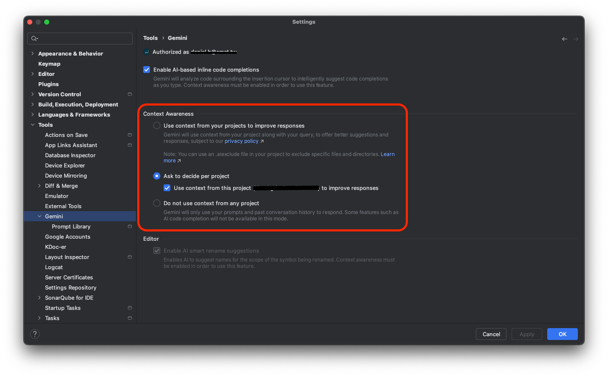

## 前言

許多開發者已經習慣使用各種 AI 工具來加速開發流程。對於 Android 開發者來說，如果不想額外付費，Google 官方推出的 **Gemini Code Assist** 無疑是最佳選擇之一。

不過，為了讓 Gemini 能提供貼近專案脈絡的建議，它需要讀取你專案內的檔案。但你是否曾經思考過：**哪些檔案應該避免被 AI 存取？**

## 保護機敏資料

這點就像我們使用 Git 時會建立 `.gitignore` 來排除不該同步的檔案一樣——像是金鑰、憑證等敏感資料。

在使用 Web 版 Gemini 時，避免提供檔案相對簡單；但在 Android Studio 中，則需要透過特定的機制進行設定。而這項機制，就是本文主角：`.aiexclude` 檔案。

## 認識 `.aiexclude`

###  `.aiexclude` 是什麼？

`.aiexclude` 的作用，就如同 `.gitignore`，放在專案資料夾下，告訴 Gemini 哪些檔案或資料夾應該排除在外、不被存取或索引。

`.aiexclude` 的語法規則與 `.gitignore` 完全一致，且支援路徑、萬用字元（如 `*`、`**`）、副檔名等。

### 實用語法範例

| 語法                       | 說明                                                                 |
|--------------------------|----------------------------------------------------------------------|
| `dev.properties`         | 排除目錄中所有名稱為 `dev.properties` 的檔案                         |
| `KEYS.*`                 | 排除所有名稱為 `KEYS`、任意副檔名的檔案                               |
| `*.api`                  | 排除所有 `.api` 副檔名的檔案                                         |
| `/*.kt`                  | 僅排除 `.aiexclude` 所在目錄下的 `.kt` 檔案                          |
| `my/sensitive/dir/`      | 排除指定目錄與其所有子目錄                                            |
| `my/sensitive/dir/**.txt`| 排除指定目錄及子目錄下所有 `.txt` 檔案                                |
| `my/sensitive/dir/*.txt` | 僅排除該目錄下的 `.txt` 檔案，不包含子目錄                            |

只要在專案根目錄（或任一子目錄）建立 `.aiexclude` 檔案，即可立即生效。

## 小結與提醒

`.aiexclude` 的設定方式簡單、彈性高，是保護機敏資訊的一道防線。

如果你的專案是公司專案，在未經授權下使用 AI 工具讀取內容，可能會涉及資安與合約風險。建議將 Android Studio 中 Gemini 的 Context Awareness 設定為 **Ask to decide per project**，依據專案需求再決定是否開啟。

此外，也別忘了把機敏檔案或資料夾明確寫入 `.aiexclude` 中，一開始設定好，就不怕誤傳。

> 📌 根據 [官方文件](https://developers.google.com/gemini-code-assist/docs/create-aiexclude-file?hl=zh-tw) 說明，若檔案在設定 `.aiexclude` 前已被索引，後續補上設定後，系統會在 24 小時內自動將該檔案自索引中移除。

## 參考資料

- [Android Studio - Configure context sharing with .aiexclude files](https://developer.android.com/studio/preview/gemini/aiexclude)
- [Gemini Code Assist - 建立 .aiexclude 檔案](https://developers.google.com/gemini-code-assist/docs/create-aiexclude-file?hl=zh-tw)
- [gitignore 語法參考](https://git-scm.com/docs/gitignore)

---

歡迎在下方留言分享你對 Gemini Code Assist 的使用經驗，或是有哪些你認為應該加入 `.aiexclude` 的檔案。讓我們一起用 AI 更聰明地寫程式，也更安全地管理專案。
