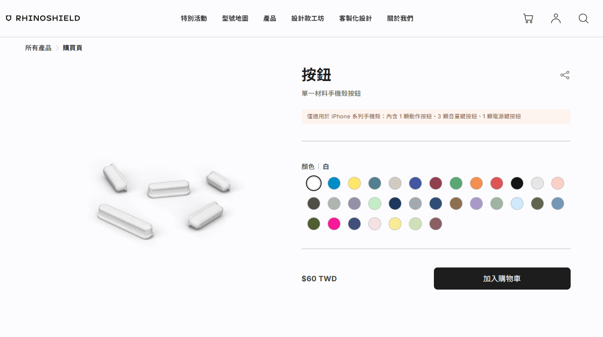
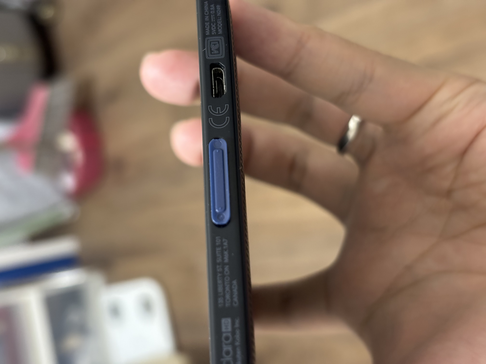

今天來分享一個跟軟體開發上無關的小故事。

Kobo 的閱讀器也買了好幾年了，最近雖然不像剛買的時候那麼頻繁地使用，但也是想到就會拿來看一下書。

但就在今年 1 月時，臨時想開機看書，卻發現底部的電源鍵整個脆化，只要輕輕一戳，塑膠按鍵的碎片就會被推入到機殼內。從碎裂的塑膠細縫中，隱約還能看到內部主機板。

上網查了一下過保後的維修服務，都只有看到跟 iFixit 合作的自行維修，而且 Kobo Clara HD 沒有在清單上...

搜尋了一輪，網路上的論壇只有提到用 3D 列印的方式，列印一個新的按鈕。甚至還有好心的網友，將 3D 列印的檔案分享出來，讓大家自行下載製作。



但...對於手邊沒有 3D 列印機的我來說，為了一顆閱讀器的小小電源鍵而買一台列印機，似乎成本有點太高...

因此，在拆機將脆化的按鍵拿出後，我開始尋找手邊是否有尺寸大小與電源鍵類似的小東西，也許可以作為替代品使用。

然後，我就發現[犀牛盾出的 iPhone 電源鍵](https://shop.rhinoshield.tw/products/button/buy)，大小非常地適合！

一開始我嘗試由內向外將按鍵卡入機殼的電源孔，但因為內部主機板與外殼的空間過小，再加上孔洞大小很剛好，所以一直無法將按鈕裝上。

正當我覺得要再找其他的替代物品時，赫然發現將按鈕由外向內裝入，可以完美塞入，而且保有按鍵按壓的回饋感，不會因為按鈕過長導致一直抵著主機板上的開機鍵。

最後我的閱讀器就變成下面這個樣子。

復活啦！！

以上方法，分享給同樣遇到電源鍵脆化的朋友XD
