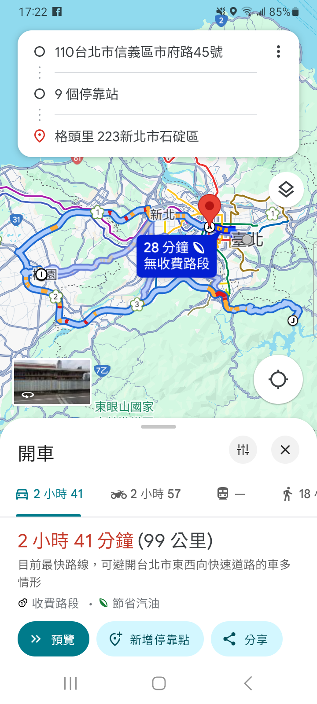
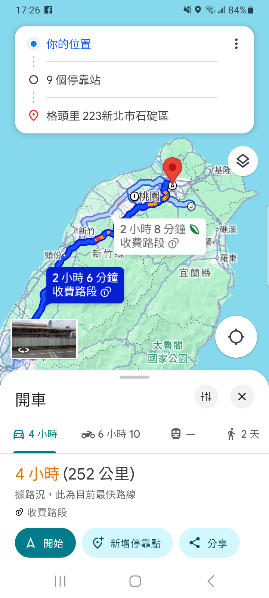
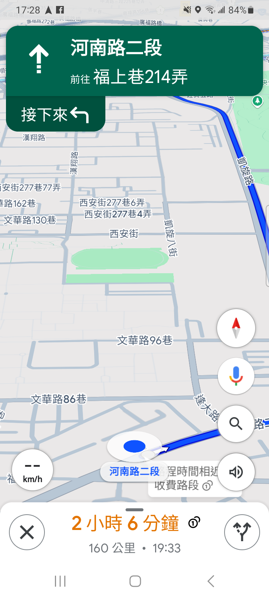

## 前言

工作上負責開發維護的一款 App，最近被提了一個新的需求。

客戶希望原有的 **開啟 Google Maps 導航** 這項功能，能夠除了起訖點外，還能在起訖點間加上停靠點。

原本以為這是件加個經緯度之類的參數，就能完成的事情。閱讀官方文件才發現，目前使用的 [Google Maps Intents for Android](https://developers.google.com/maps/documentation/urls/android-intents) 並不支援停靠點。

如果要有停靠點，就只能改用支援跨平台的 Maps URLs，且只有路徑規劃，沒有導航。

> 💡 路徑規劃跟導航差在哪裡？
> 
> 路徑規劃只會顯示起訖點與各停靠點間的路線。
> 導航則是會以目前定位直接開啟到目的地的路線指引。

也就是說，路徑規劃比較像是 App 內執行導航的前一個步驟，使用者必須自己按下開始導航。

## 什麼是 Maps URLs

[Maps URLs](https://developers.google.com/maps/documentation/urls/get-started) 是用來開啟 Google Maps App/Web 的跨平台 URL。這裡的跨平台包含 Android、 iOS 、 Web ，三大平台都可以支援。

目前已支援開啟的 App 功能有：

1. Search 搜尋
2. [Directions 路徑規劃](https://developers.google.com/maps/documentation/urls/get-started?hl=zh-tw#directions-action)
3. Display a Map 顯示地圖
4. Display a Street View panorama 街景服務

今天這篇文章只會提到第二個的路徑規劃，其他三種功能我之後會再另開文章補上~

## 路徑規劃

顧名思義，就是開啟 Google Maps 的路徑規劃功能。
呼叫之後會在 Google Maps 上開啟點到點之間的路徑，並顯示距離和時間。

<table>
    <thead>
        <tr>
            <th style="width:33.3%; text-align:center;">路徑規劃示意圖</th>
            <th style="width:33.3%; text-align:center;">路徑規劃示意圖 (使用定位作為起點)</th>
            <th style="width:33.3%; text-align:center;">導航示意圖</th>
        </tr>
    </thead>
    <tbody>
        <tr>
            <td style="width:33.3%; text-align:center;">
                
            </td>
            <td style="width:33.3%; text-align:center;">
                
            </td>
            <td style="width:33.3%; text-align:center;">
                
            </td>
        </tr>
    </tbody>
</table>

以上面三張圖來說，左側與中間的圖是路徑規劃，右側的圖是導航功能。

廢話不多說，就來看看怎麼實作吧！

## URL 格式

路徑規劃的 baseUrl：`https://www.google.com/maps/dir/?`

### 參數

| 參數名稱                   | 說明                                              | 必填  | 範例  |
| ---------------------- | ----------------------------------------------- | --- | --- |
| `api=1`                | 固定參數，表示使用 Google Maps URLs API                  | ✅   |     |
| `origin`               | 起點 ( 地名、地址、`緯度,經度` )<br>須要使用 URL-encoded        | ✅   |     |
| `destination`          | 終點 ( 地名、地址、`緯度,經度` )<br>須要使用 URL-encoded        | ✅   |     |
| `travelmode`           | 導航模式 （沒寫會使用 App 的設定）                            |     |     |
| `waypoints`            | 停靠點（使用 `\|` 分隔，接受格式同 `origin` 與 `destination` ） |     |     |
| `avoid`                | 路徑規劃須避免的道路類型，可多選。須使用 `,` 分隔。                    |     |     |
| `origin_place_id`      | 使用 Place ID 標記起點                                |     |     |
| `destination_place_id` | 使用 Place ID 標記終點                                |     |     |
| `waypoint_place_ids`   | 使用 Place ID 標記停靠點                               |     |     |
| `dir_action`           | 路徑規劃頁的行為                                        |     |     |

乍看之下，參數似乎很多，但如果沒有要太多的客製化，只要關注在 `origin`、`destination`、`waypoints` 這三個參數就可以了。

> 🚨 **停靠點的限制**
> 
> 網頁版最多 3 個。
> 
> App ( iOS & Android) 最多 9 個。
> 
> 另外，不是所有 Google Maps 的產品都有支援。(文件內沒有細講有哪些產品。)

如果想要設定路徑的其他條件，可以參考下面所列的參數，個別補上。

- 導航模式：
	- `driving` 開車
	- `walking` 走路
	- `bicycling` 腳踏車
	- `two-wheeler` 兩輪 (機車類的）
	- `transit` 大眾運輸
- URL-encoded 對照
	- `|` 👉 `%7C`
	- `,` 👉 `%2C`
- `avoid` 類型
	- `ferry`
	- `highways`
	- `tolls`
- `origin_place_id`、`desitination_place_id`、`waypoint_place_ids`
	- [Place ID](https://developers.google.com/maps/documentation/places/web-service/place-id) 可以更精準的定位到指定的位置。
	- 這幾個參數只是輔助，原本的起點、終點、停靠點的參數還是要帶。

## 範例

因為 Maps URLs 支援跨平台，所以這些範例連結都可以在電腦或手機瀏覽器上直接開啟。

1. 單純開啟路徑頁
   - https://www.google.com/maps/dir/?api=1
2. 起訖點開車的路徑規劃
   - https://www.google.com/maps/dir/?api=1&origin=25.033964,121.564468&destination=24.936078,121.617829&travelmode=driving
3. 起訖點間包含兩個停靠點的路徑規劃
   - https://www.google.com/maps/dir/?api=1&origin=25.033964,121.564468&destination=24.936078,121.617829&travelmode=driving&waypoints=25.047924,121.517081|24.993628,121.301356

## 在 Android 上呼叫

程式沒有很複雜，基本概念就是將參數依格式組好，轉成 `Uri` 後透過 `Intent.ACTION_VIEW` 丟給 Google Maps App 處理。

```kotlin
package tw.dh46.ithome23.sample.intent  
  
import android.content.Context  
import android.content.Intent  
import android.net.Uri  
import com.google.android.gms.maps.model.LatLng  
  
/**  
 * Created by danielhuang on 2025/2/7 
 * GoogleMapsIntentHelper 是一個工具類，用於使用 Google Maps App 啟動導航功能。  
 */  
object GoogleMapsIntentHelper {  
  
    // Google Maps 路徑規劃的基礎 URL    
    private const val MAPS_BASE_URL = "https://www.google.com/maps/dir/?"  
    // Google Maps 最大停靠點數  
    private const val MAX_WAYPOINTS = 8  
  
    /**  
     * 啟動 Google Maps 導航功能  
     *  
     * @param context  
     * @param navRequest 導航請求的詳細資料，包括起點、終點、停靠點與交通模式  
     */  
    fun startNavDirection(  
        context: Context,  
        navRequest: NavRequest  
    ) {  
        // 建立 Navigation URL        
        val navigationUrl = buildNavigationUrl(navRequest)  
  
        // 建立 Intent 並設定目標為 Google Maps App
        val intent = Intent(Intent.ACTION_VIEW, Uri.parse(navigationUrl))  
            .apply {  
                // 確保使用 Google Maps App                
                setPackage("com.google.android.apps.maps")  
            }  
  
        // 檢查是否安裝 Google Maps，並啟動導航  
        if (intent.resolveActivity(context.packageManager) != null) {  
            context.startActivity(intent)
        } else {  
            throw GoogleMapsNotFoundException()  
        }  
    }  
  
    /**  
     * 建立完整的導航 URL
     * @param navRequest  
     * @return  
     */  
    private fun buildNavigationUrl(navRequest: NavRequest): String {  
        // 固定參數  
        val apiType = "api=1"  
        // 起點  
        val originStr = "&origin=${navRequest.origin.latitude},${navRequest.origin.longitude}"  
        // 終點  
        val destinationStr =  
            "&destination=${navRequest.destination.latitude},${navRequest.destination.longitude}"  
        // 導航模式  
        val travelMode = "&travelmode=${navRequest.travelMode.value}"  
  
        // 轉換停靠點成字串格式  
        val waypointsStr = navRequest.waypoints.toWaypointsStr()  
  
        // 建立完整的導航 URL        
        return "$MAPS_BASE_URL$apiType$originStr$destinationStr$travelMode$waypointsStr"  
    }  
  
    /**  
     * 將停靠點座標列表轉換為 Google Maps URL 所需的字串格式  
     *  
     * @return 停靠點的字串，若無停靠點則為空字串  
     */  
    private fun List<LatLng>?.toWaypointsStr(): String {  
        if (isNullOrEmpty()) return ""  
  
        if (size > MAX_WAYPOINTS) {  
            throw TooManyWayPointsException()  
        }  
  
        val points = this.joinToString("|") {  
            "${it.latitude},${it.longitude}"  
        }  
        return "&waypoints=$points"  
    }  
  
    /**  
     * 導航模式  
     *  
     * @property value value 對應於 Google Maps 的導航模式參數值  
     * @constructor Create empty Travel mode  
     */    
     enum class TravelMode(val value: String) {  
        DRIVE("drive"), // 開車  
        WALKING("walking"), // 步行  
        BICYCLING("bicycling"), // 騎自行車  
        TRANSIT("transit"), // 大眾交通工具  
        TWO_WHEELER("two-wheeler") // 雙輪車 (如摩托車)  
    }  
  
    /**  
     * 導航請求的資料類  
     *  
     * @param origin 起點座標  
     * @param destination 終點座標  
     * @param waypoints 停靠點列表 (最多 8 個)  
     * @param travelMode 交通模式，預設為開車模式  
     */  
    data class NavRequest(  
        val origin: LatLng,  
        val destination: LatLng,  
        val waypoints: List<LatLng>? = null,  
        val travelMode: TravelMode = TravelMode.DRIVE  
    )  
}  
  
class GoogleMapsNotFoundException: RuntimeException("No Google Maps app found on device")  
  
class TooManyWayPointsException: IllegalArgumentException("Way points cannot exceed 8!")
```

## 結語

以上就是使用 Maps URLs 開啟路徑規劃功能的介紹，有任何問題歡迎下面留言討論~ 👋
