## 什麼是 SonarQube

SonarQube 是一個由 Sonar 公司所推出的原始碼檢測平台，支援多種程式語言與專案框架。使用 SonarQube 掃描專案程式碼，平台會將品質不良或有資安疑慮的程式列出，並提供可行的修復方式，協助開發者撰寫品質與安全兼具的程式。

SonarQube 系列有許多不同的產品，其中原始碼檢測的服務有區分 Server 與 Cloud 兩種產品，兩者間最大的差異就是自架或是雲端，功能與價錢的差異可以直接到它的官網上查看。

今天要介紹的是**免費的社群版本 SonarQube Server Community Build**。

## SonarQube Server Community Build

SonarQube Server Community Build 是 Sonar 公司釋出的開源版本，相對於付費的 Server / Cloud 功能有些刪減，最大的差別就是支援的語言種類。

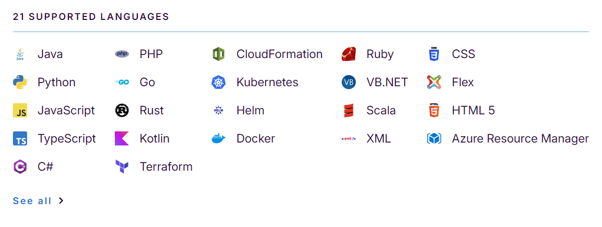

如果你要檢測的專案開發語言並沒有在上面這張圖中，就需要升級到 Developer edition 或是 Enterprice edition 才有辦法做檢測，更詳細的說明可以看[這裡](https://www.sonarsource.com/products/sonarqube/downloads/)。

## 安裝

### 0. 確認 SonarQube 環境需求

安裝前建議先到 [Server host requirements](https://docs.sonarsource.com/sonarqube-community-build/server-installation/server-host-requirements) 查看所需的環境設定。

以 SonarQube Community Build v25.11.0.114957 來說，會需要安裝 Java 17 或 Java 21，這可以到 [OpenJDK](https://jdk.java.net/archive/) 下載指定的版本。

### 1. 下載安裝檔

至官網下載 Community Edition，並將下載完成的 Zip 檔解壓縮到你喜好的路徑。

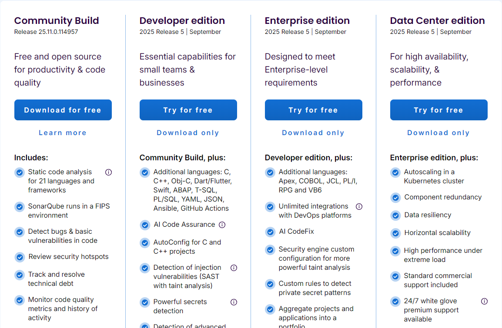

### 2. 開啟解壓縮目標內的 bin 資料夾

以  Windows 11 來說，請選擇 `windows-x86-64` 這個資料夾。

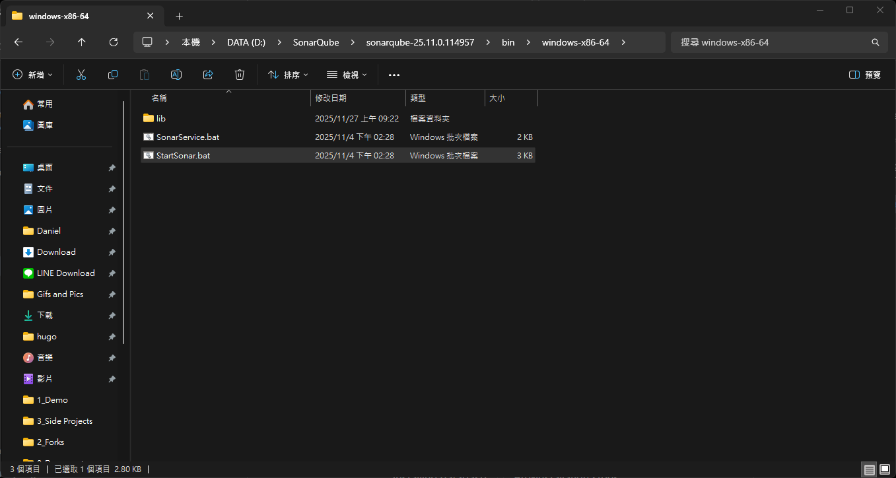

### 3. 開啟命令提示字元，並執行 StartSonar.bat

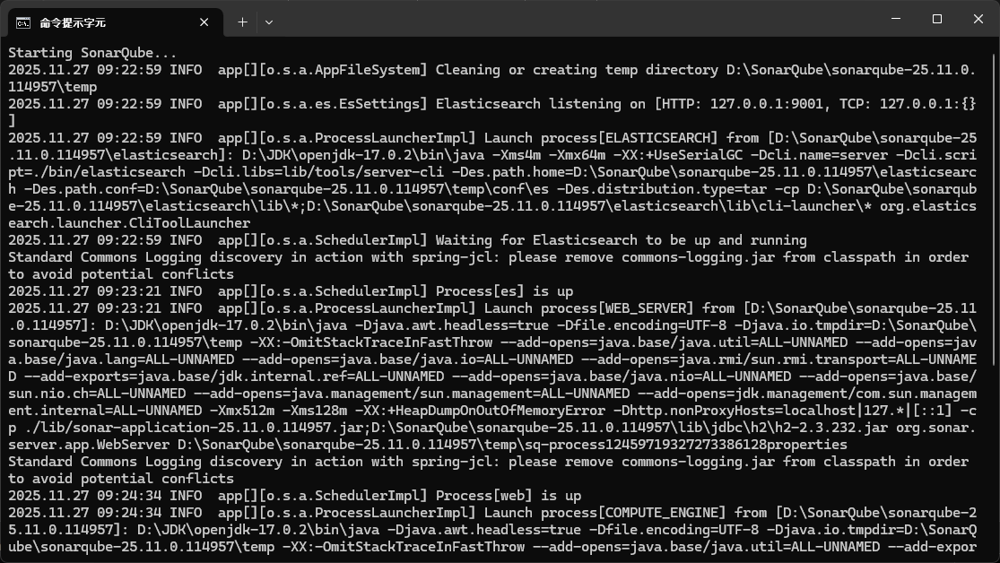

啟動會需要一段時間，但只要最後有看到 `SonarQube is operational` 這行出現，就代表有啟動成功了。

### 4. 網頁開啟預設路徑 `localhost:9000` 執行登入。

輸入預設的登入帳號 (admin) 與密碼 (admin)。

### 5. 更新預設密碼

首次登入後，SonarQube 會提示更新預設密碼，更新完成之後就會看到歡迎畫面了。

## 使用 (以 Android 專案為例)

### 1. 建立新專案

點選畫面右上角的 Create project 並選擇 Manually 建立新專案。

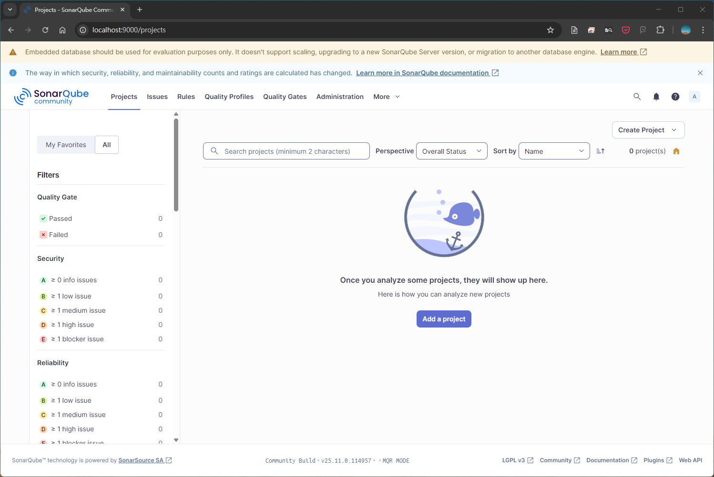

如果是要搭配 DevOps 使用，點選下拉選單的 `Import from DevOps Platforms` 會看到下面這個畫面，可以選擇程式碼所使用的平台。

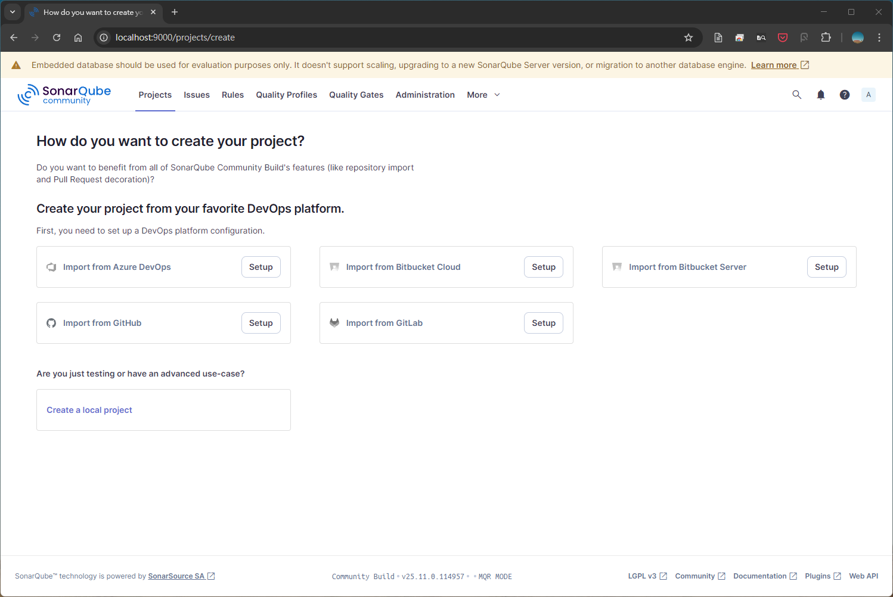

這裡我們選擇建立 `Local Project`，並依序填寫以下資料。

- `Project display name`：專案在 SonarQube 所顯示的名稱。
- `Project key`：專案在 SonarQube 裡的唯一碼，這部分的命名可以看團隊有沒有統一的格式，不然就是不要重複就可以了。
- `Main branch name`：專案主分支的名稱，如果預設填入的 main 跟你的專案不同，記得要改成與專案一致的名稱。

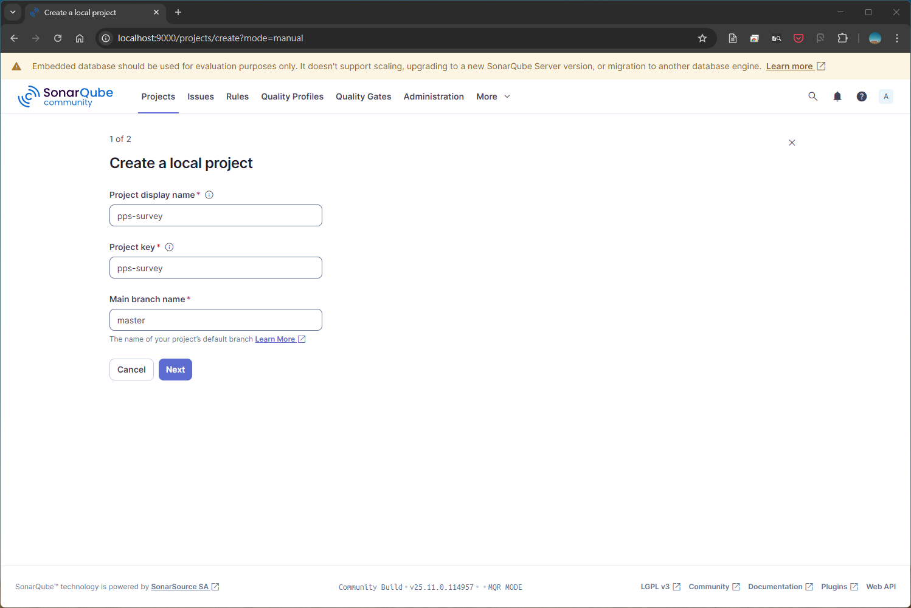

### 2. 選擇 New Code 的定義

這裡的 New Code 設定，是要讓 SonarQube 知道哪些異動會是新的變更，如果沒有特殊需求，可以選 `Follows the instance's default` 這個預設值。

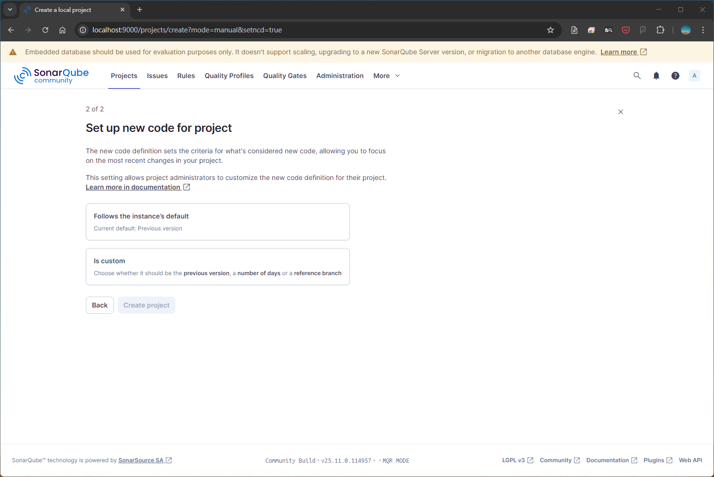

### 3. 選擇分析的執行方式

這裡我們沒有要搭配 CI，所以選擇 Locally。

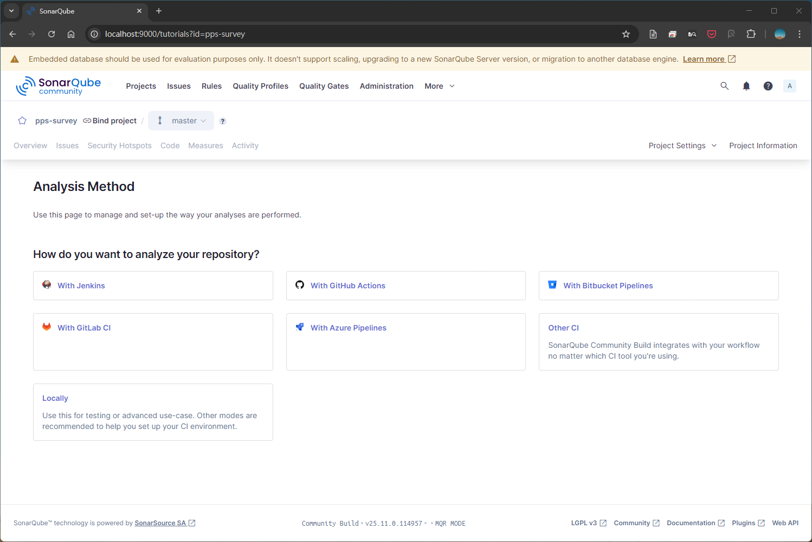

### 4. 設定專案 Token 與 IDE Plugin

#### 1. Provide a token

- Token 在執行分析時會帶入，用來辨識執行的是哪一個分析任務。
- 可以單獨替專案建立 Token，也可以使用帳號的 Token。
- Token 權限與時效通常在團隊使用上比較會用到，如果是個人使用可以隨意。

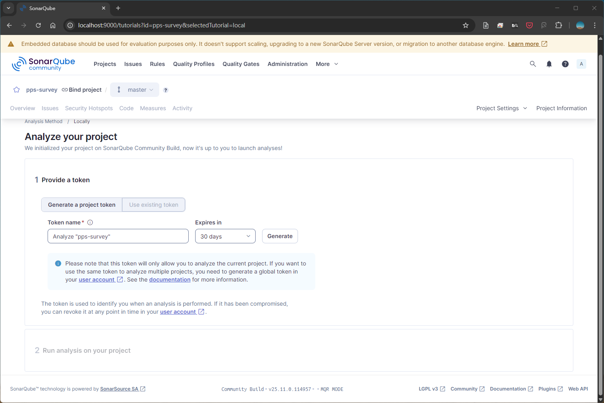

#### 選擇專案建置平台 `Run analysis on your project`

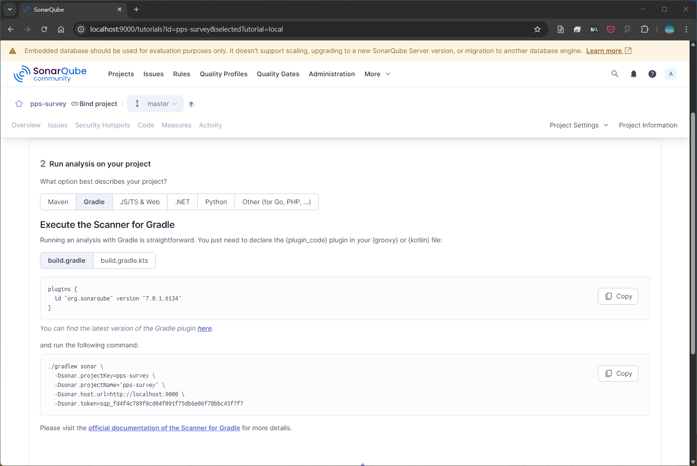

因為是 Android 專案所以選 `Gradle`，並將 Code block 裡的設定值複製到 Android 專案裡的 `build.gradle`。因為每個人的專案環境不盡相同，可以參考[SonarQube Gradle 設定文件](https://docs.sonarsource.com/sonarqube/latest/analyzing-source-code/scanners/sonarscanner-for-gradle/)，或者文章下面留言，我來幫你看看。

基本上這裡設定完後，專案應該要能夠正常 `sync` & `build`。
### 5. 建立 SonarQube 的 Run Config 並執行

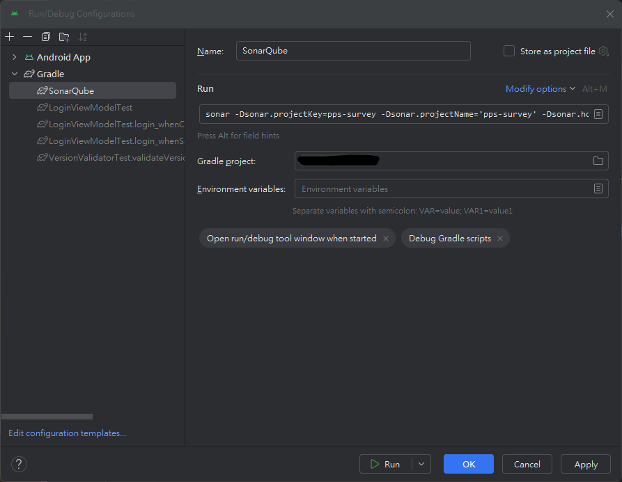

將 SonarQube 網頁上的 `gradle` command 複製下來，並根據下面步驟建立 Run Config。

1. 開啟 Android Studio 的 Run/Debug Configurations。
2. 左上角加號建立一個新的 Config
3. 設定名稱為 SonarQube
4. 在 Run 中貼上指令並清除不必要的斜線 `\` 與換行，看起來應該要類似下面這樣。

```
sonar Dsonar.projectKey=YOUR_PROJECT_KEY -Dsonar.projectName='YOUR_PROJECT_NAME' -Dsonar.host.url=http://localhost:9000 -Dsonar.token=THIS_IS_MY_TOKEN
```

5. 儲存後就可以在下拉選單中執行，等 IDE 跑完就可以在 SonarQube 上看到結果。

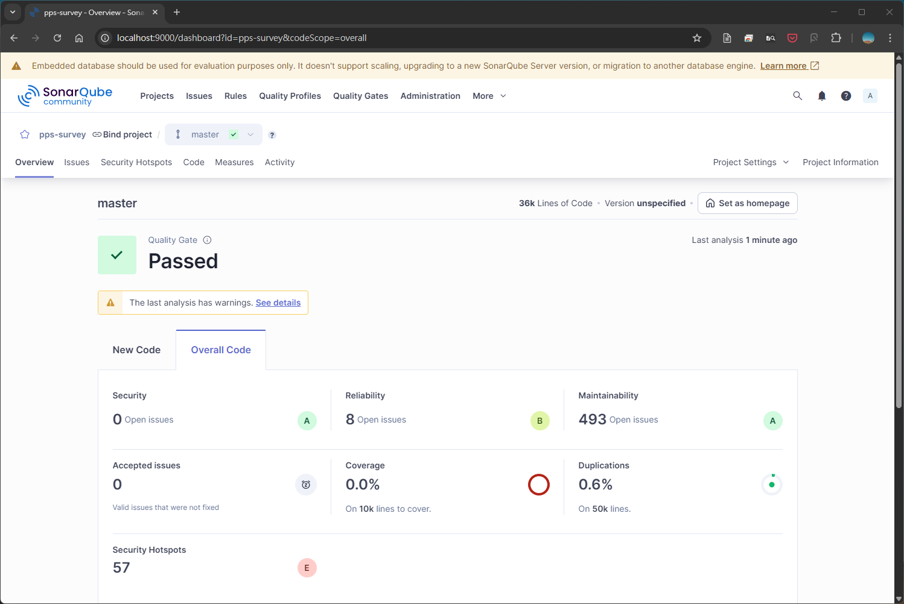

## 延伸補充

### 如何切換分支

Community Build 的版本預設是不能切換檢測的分支，除非升級到 Developer 以上。
根據爬文出來的結果，但只要安裝 [sonarqube-community-branch-plugin](https://github.com/mc1arke/sonarqube-community-branch-plugin) 就可以了。

以下是簡易的安裝流程：

> 測試環境資訊
> 作業系統：Windows 11
> 平台版本：SonarQube Community Build - v25.11.0.114957
> 套件版本：SonarQube Community Branch Plugin - v25.9.0

1. Plugin 的 [Release page](https://github.com/mc1arke/sonarqube-community-branch-plugin/releases/tag/25.9.0) 下載 [sonarqube-community-branch-plugin-25.9.0.jar](https://github.com/mc1arke/sonarqube-community-branch-plugin/releases/download/25.9.0/sonarqube-community-branch-plugin-25.9.0.jar) 與 [sonarqube-webapp.zip](https://github.com/mc1arke/sonarqube-community-branch-plugin/releases/download/25.9.0/sonarqube-webapp.zip) 這兩個檔案。
2. 開啟 SonarQube 所安裝的資料夾，並將前一步驟下載的 `jar` 複製到 `extensions\plugins` 路徑下。
3. 同樣在安裝資料夾內，尋找 `conf\sonar.properties` 這個檔案，並更新下列兩個參數後存檔。（可以用 `javaAdditionalOpts` 作為關鍵字在檔案內查詢。）
	1. `sonar.web.javaAdditionalOpts=-javaagent:./extensions/plugins/sonarqube-community-branch-plugin-25.9.0.jar=web`
	2. `sonar.ce.javaAdditionalOpts=-javaagent:./extensions/plugins/sonarqube-community-branch-plugin-25.9.0.jar=ce`
4. 開啟 SonarQube 安裝路徑內的 `web` 資料夾，將其清空並貼上 `sonarqube-webapp.zip` 解壓縮的內容。
5. 啟動 SonarQube，如果順利跑完，登入後應該會出現 `Installation of plugins` 的警告，按下 `I understand the risk` 就可以了。

> 在嘗試安裝的過程中有出現 Elasticsearch 失敗的錯誤，問 Gemini 後查出來是 `java.exe` 卡住了 `9001 port`，手動關閉它後嘗試重啟依然不行。最後是電腦重開機才順利啟動 SonarQube 。

接下來是專案這裡的 Run Config 要調整。

在原本的 Gradle command 加上 `-Dsonar.branch.name=${YOUR_BRANCH_NAME}` 這條，完整的樣子應該會像這樣。（一開始我查到的參數是使用 `sonar.branch`，但都會跑出指令不支援請升級到 Developer 版的錯誤訊息。後來才發現是參數的問題，所以務必確認輸入的參數正確。）

```
sonar 
-Dsonar.projectKey=YOUR_PROJECT_KEY 
-Dsonar.projectName='YOUR_PROJECT_' 
-Dsonar.branch.name=YOUR_BRANCH_NAME
-Dsonar.host.url=http://localhost:9000 
-Dsonar.token=YOUR_TOKEN
```

成功執行 Gradle 任務後，在 SonarQube 應該就可以看到該分支的檢測結果了。

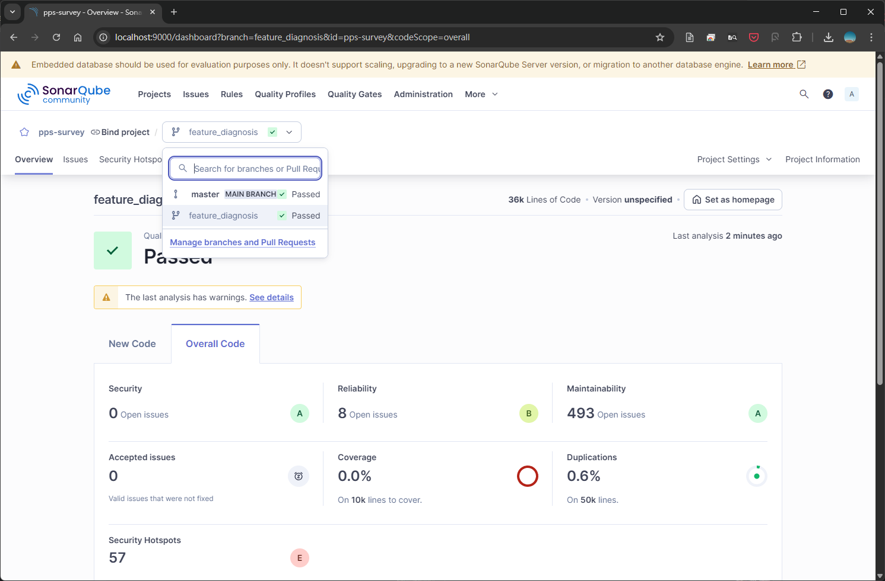

> 另外補充，SonarQube v10.6 + plugin 1.22.0 這樣的組合測試過可使用。
> 提供給用舊版的人參考。

### 防患於未然 - 裝個 SonarQube for IDE 吧

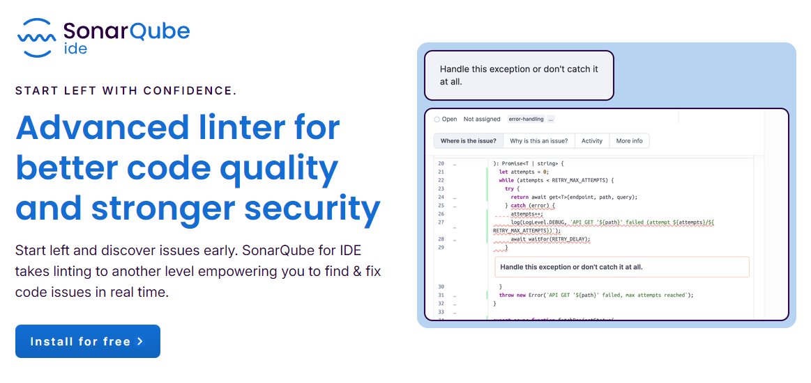

除了 SonarQube Server/Cloud 之外，我個人也滿推薦搭配使用 SonarQube for IDE。它能夠在開發階段就即時顯示出程式的潛在問題，讓開發者可以快速修正，不用等到 SonarQube Server 掃描時再解決。它支援大部分主流的 IDE，例如 JetBrains、VSCode、Visual Studio 等。更重要的一點是，它免費。XD

---

以上就是如何使用 SonarQube Community Build，替 Android 專案執行原始碼檢測的操作流程。如果對於文章內容，或是 SonarQube 這個檢測工具有任何疑問，歡迎留言討論~

下次見！👋

---

## 參考資料

- [iThome: 開源程式碼檢測平台：SonarQube](https://ithelp.ithome.com.tw/articles/10215842)
- [SonarQube Official WebSite](https://www.sonarsource.com/products/sonarqube/)
- [簡單使用SonarQube掃描Android專案](https://www.tpisoftware.com/tpu/articleDetails/2227)
- [Medium: 原來程式碼品質也可以被檢測：初探 SonarQube](https://medium.com/starbugs/%E5%8E%9F%E4%BE%86%E7%A8%8B%E5%BC%8F%E7%A2%BC%E5%93%81%E8%B3%AA%E4%B9%9F%E5%8F%AF%E4%BB%A5%E8%A2%AB%E6%AA%A2%E6%B8%AC-%E5%88%9D%E6%8E%A2-sonarqube-14e99687806e)