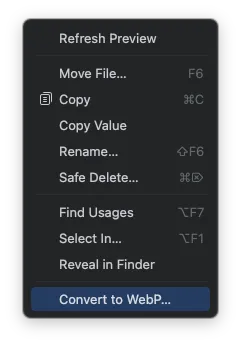
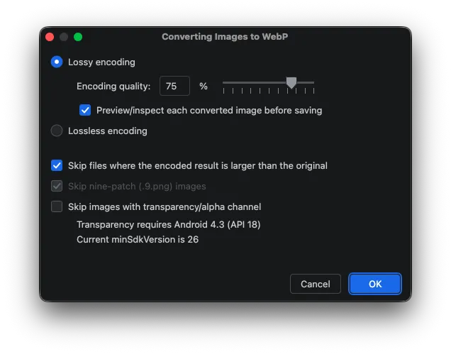
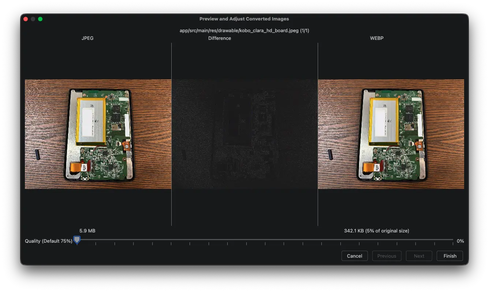
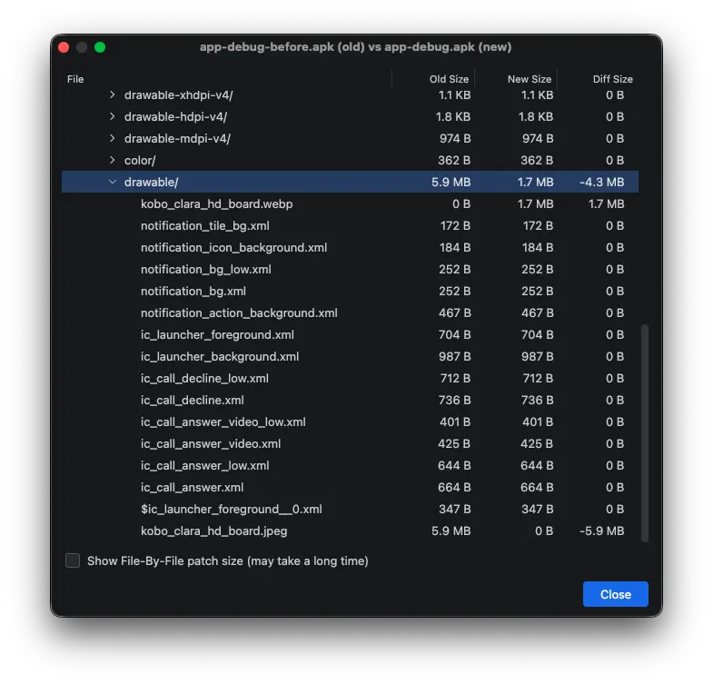

## 前言

專案產出的 APK/App Bundle 體積超大，一查發現是靜態圖檔的檔案太大。該怎麼處理？

圖片轉成 WebP 通常是最簡單且有效的做法。

## 什麼是 WebP

[WebP](https://developers.google.com/speed/webp?hl=zh-tw) 是由 Google 開發的圖片格式，在相同圖片品質下，它的檔案大小較小，適合網路傳輸，支援無損、有損、透明度與動畫。

Android 從 4.0 開始支援有損 WebP，4.2.1 之後支援無損與透明度的 WebP。在 Android 17 要推出的 2026 年，市面上的裝置全部都有支援。

## 如何快速轉檔

實務上，如果團隊有 UI/UX 設計師，理想流程是請他們提供符合需求的格式與尺寸，因為他們最了解要呈現的效果。不過若是要由開發端自己處理，Android Studio 內建的「Convert to WebP」工具就很方便。

步驟如下：

1. 在 Android Studio 中，選取你想轉換的圖片，並按下滑鼠右鍵開啟功能選單，選擇 「Convert to WebP...」。
2. 設定轉換參數： 
	1. 根據需求可以勾選 "Lossy"（失真，體積最小）或 "Lossless"（無損）。
	2. 如果轉換後檔案沒有比較小自動略過，這個選項也建議勾。
3. 即時預覽： 它會顯示轉換前與轉換後的檔案大小對比，你可以滑動拉桿觀察畫質變化。如果有差異會在中間的 Difference 區塊顯示。
4. 轉換完成

用 APK Analyzer 來比較一下大小。

可以明顯地看到，JPEG 圖檔壓縮品質設定在 50% 的情況下，檔案大小從 5.9 MB 變成了 1.7 MB。

瘦身成功！

## 結語

以上就是簡單的 Android Studio WebP 轉檔功能介紹。  
歡迎留言告訴我，在閱讀這篇筆記前，你知道 Android Studio 有這個功能嗎？

下次見，掰～ 😂
