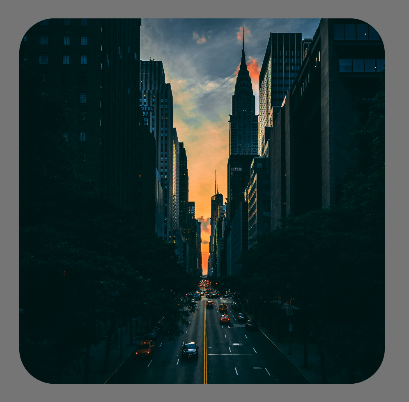
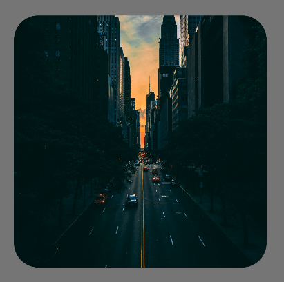

在製作縮圖類型的 UI 介面的時候，我們很常使用 Compose `Image` 的 `contentScale = ContentScale.Crop`，讓圖片被稍微局部裁剪維持介面的一致性。

預設狀態下，`Image` 會裁剪圖片的中央位置。

不過，如果設計稿的規格，是要裁剪圖片的特定位置呢？

## 範例

以下面這個例子來說，設計稿的要求是要將尖塔型的大樓完整露出。



但如果是使用預設的設定，會是這樣子：



目標大樓很明顯地被裁剪了。
## 解決方式：使用 `BiasAlignment` 調整 `alignment` 參數

```kotlin
Image(
    painter = painterResource(id = R.drawable.your_image),
    contentDescription = null,
    modifier = Modifier.size(200.dp),
    contentScale = ContentScale.Crop,
    alignment = Alignment.TopCenter // 這裡調整裁剪位置
)
```

在未做設定的情況下，`alignment` 預設會是 `Center`。如果要裁剪的位置沒有太特殊，可以利用 `Alignment` 本身的 companion properties，基本的上中下左右等位置的設定都可以滿足，完整清單可以看 [API Reference: Alignment](https://developer.android.com/reference/kotlin/androidx/compose/ui/Alignment) 。

但今天要聊的是，下面的 `BiasAlignment`。

### 自定義調整 `BiasAlignment`

`BiasAlignment` 根據文件上的定義，就是用偏移量來指定對齊方式。

偏移量的範圍是 `-1f ~ 1f`：

- `0f` 代表對其置中。
- `-1f` 代表對齊起始（左側）/頂端。
- `1f` 代表結尾（右側）/底部。

當偏移量超過這個範圍，對齊後的結果，可能會有部分或全部的內容在可見範圍外。

| horizontalBias | verticalBias | 對應位置 |
| ---------------| ------------ | ------- |
| 0f | 0f | 正中央|
| 0f | -1f | 頂端置中|
| -1f | 1f | 左下角|

如果還是不清楚，可以實際改變一下參數，你應該就會很清楚知道該怎麼調整了～

回到最一開始的例子，因為目標大樓是在圖片中心點稍微偏向上方的位置，所以我們最終的參數會是：

```kotlin
Image(
    // ... 其他參數
    alignment = BiasAlignment(horizontalBias = 0f, verticalBias = -0.7f),
    contentScale = ContentScale.Crop
)
```

## 同場加映：`BiasAbsoluteAlignment`

這個類別跟前面介紹的 `BiasAlignment` 用法一樣，唯一不同的是，它具有**絕對的方向性**。
也就是說，它的水平偏移量概念是基於絕對的 Left（左） 與 Right（右）。

舉例來說，我們將水平偏移量都設為 `-1f`

- `BiasAbsoluteAlignment` (絕對對齊)：永遠對齊螢幕的左邊。
- `BiasAlignment` (相對對齊)：永遠對齊 Start 起始位置。
     - 在 LTR（如繁體中文、英文）環境下，Start 在左邊。
     - 在 RTL（如阿拉伯文、希伯來文）環境下，Start 會自動變成在右邊。

通常在大部分支援國際化的 UI 設計下，用 `BiasAlignment` 是沒有問題的。不過，如果 UI 本身具有強烈的絕對方向性，例如：指向畫面左邊的箭頭，那就建議使用 `BiasAbsoluteAlignment`。

## 結語

以上就是如何在 Jetpack Compose `Image` 使用 `ContentScale.Crop` 的時候，設定指定的裁剪位置。

希望這次的分享有幫到正在閱讀的你。  

畢竟，在這個萬世問 AI 的時代，不確定還會有多少真人看到這篇文章，但我能夠保證的是，寫這篇文章的人是真人。🤣
 
## 參考資料

- [Android Doc: BiasAlignment](https://developer.android.com/reference/kotlin/androidx/compose/ui/BiasAlignment)
- [Android Doc: Alignment](https://developer.android.com/reference/kotlin/androidx/compose/ui/Alignment)
- [Android Doc: BiasAbsoluteAlignment](https://developer.android.com/reference/kotlin/androidx/compose/ui/BiasAbsoluteAlignment)
- 測試用圖片來源：Photo by <a href="https://unsplash.com/@malteesimo?utm_source=unsplash&utm_medium=referral&utm_content=creditCopyText">Malte Schmidt</a> on <a href="https://unsplash.com/photos/low-light-photography-of-vehicle-crossing-road-between-high-rise-buildings-enGr5YbjQKQ?utm_source=unsplash&utm_medium=referral&utm_content=creditCopyText">Unsplash</a>
