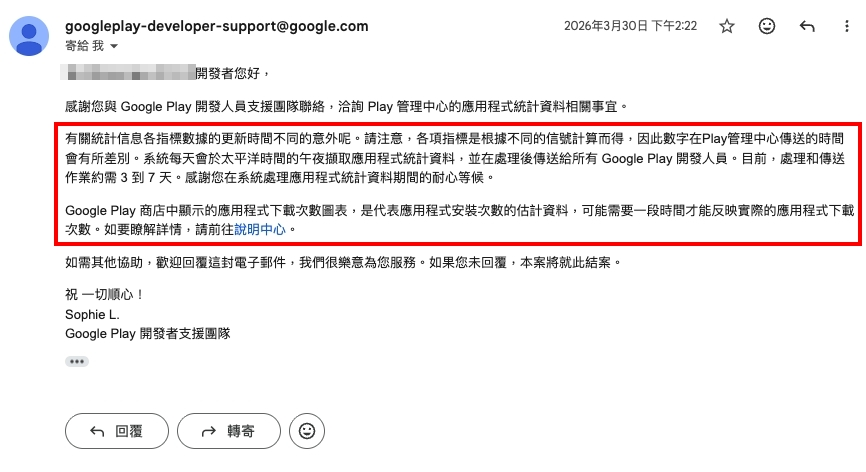

前陣子 PM 被客戶索取 App 的下載數等統計資料，原本以為之前提供的教學文章已足夠，沒想到被問了一個我從來沒發現的問題...

## 統計資料日期不同步的現象

點開 Play Console 中任一 App 的統計資料頁籤。在設定不同的指標與條件下，同樣的篩選日期區間會呈現不同的統計資料，其中最新一筆資料的日期也不相同。

舉例來說，我們在 3 月 26 日當天查詢資料，設定的篩選日期區間為 3 月 1 日至 3 月 26 日，原本預期會看到 3 月 1 日至 3 月 26 日的統計結果，或至少會是到 3 月 25 日的結果。然而，使用不同的事件條件篩選，得到的最新一筆資料時間卻分別為：

- 篩選 A 事件：最新資料為 3 月 21 日
- 篩選 B 事件：最新資料為 3 月 23 日

另外，嘗試透過 Play Console 首頁左側的「下載報表 → 統計資料 → 2026 年 3 月」路徑查詢，下載下來的最新一筆資料時間則是 3 月 22 日。

## Play Console 內部的資料傳送時間差

查詢 Google Play Console 官方文件後沒有明確說明，只能發信詢問客服。根據 Google 的回覆，主要原因如下：

- **不同指標的計算信號不同**：統計資料的各項指標是根據不同的信號計算而得，因此數字在 Play 管理中心傳送的時間會有所差別。
- **每日擷取時間固定**：系統每天會於太平洋時間的午夜擷取應用程式統計資料，並在處理後傳送給所有 Google Play 開發人員。
- **資料處理延遲**：處理和傳送作業約需 3 至 7 天。

## 結論與建議

如果需要查詢特定時間區間的統計資料，在 Google Play Console 上進行查詢時，務必預留 **3 至 7 天的時間差**，才可能取得該時間區間完整的統計資料。

由於平台的限制無法改變，如果業務上有即時統計的需求，可考慮搭配 Google Analytics 或 Firebase 作為補充方案，以獲得更及時的數據分析。
